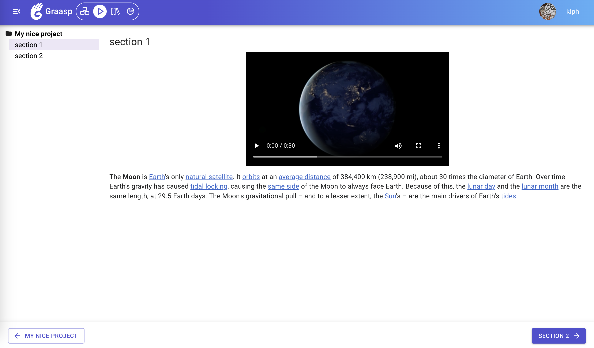

The latest update to Graasp bring numerous improvements. Highlights include a <strong>navigation between sections in Graasp Player</strong>, a new map layout mode and a dropzone helper in Graasp Builder. We resolved an issue that prevented the update of the profile picture in Graasp Account, and significant enhancements to the Sketchfab app. Read further to see the full details!

<!-- Everything below this will not be shown in the post overview -->
<!-- truncate -->

## Graasp Player

- Introducing a navigation bar. This makes navigating lessons in order a lot easier.

## Graasp Builder

- Introduced the new map layout mode. You can now see your items on a map (items will need to have a geo-location set). This new view completes the existing ones: List and Grid.
- To improve the user experience in empty folders, a helper is now displayed. This should improve the first experiences of users and allow them to add content more easily on the platform.

## Graasp Account

- Fixed an issue preventing to update the profile picture because the modal shown to crop the image was not displaying the file.

## Graasp Apps

- Sketchfab:
  - Added Spanish translations.
  - Introduced an analytic view for insightful data insights.
  - Migrated to TypeScript for improved codebase maintainability.
  - The app now saves actions when users interact with a 3D model in the player view.

## Graasp Library

- Fixed an issue where a collection could display parent element that were not published. This issue only leaked the parent names, as users were not able to access the private elements. Now a collection that is published inside a private parent will show in the same way as if it was not inside that parent element allow users to organize their collections however they like without the parent structure showing in the library.
- Updated translations to broaden accessibility for users with different language preferences.
- Improved loading animations and reduced layout shifts after load for a better user experience.

## General

- Implemented optimizations to streamline analytic traces for smoother platform performance and an enhanced user experience overall.
- Fixed an issue that prevented to change the "Show iframe" setting for link elements.
- Improved translation of emails, the small text at the end should now be translated too.

We warmly welcome and encourage feedback from our users to continuously improve our platform. You can contact us by email [admin@graasp.org](mailto:admin@graasp.org) or by submitting an issue in this [Github repository](https://github.com/graasp/graasp-feedback).
