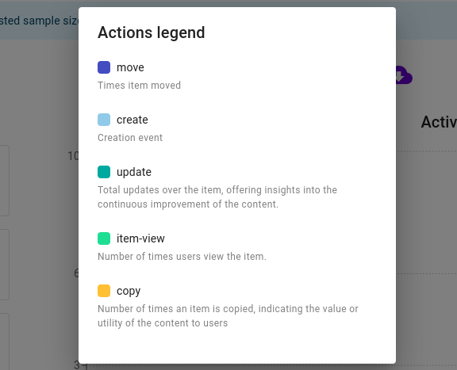
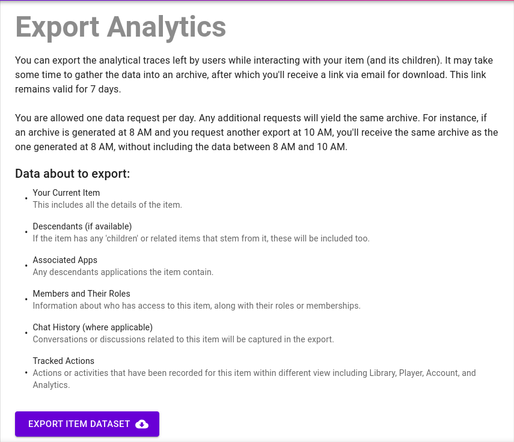

We're thrilled to unveil our latest visual enhancement: the introduction of a new font! Alongside many consequent changes in Graasp Analytics, and across all other platforms. Read further for more information.

<!-- Everything below this will not be shown in the post overview -->
<!-- truncate -->

## General

We're thrilled to unveil our latest visual enhancement: the introduction of a new font _Nunito_. This addition marks a pivotal moment in our journey toward revitalizing our aesthetic, amplifying our communication and reinforcing our distinct identity across all platforms. We're moving all of our interfaces to use this font, the change might take some time to be 100% effective. Let us know if we missed any spot!

## Graasp Account

- **Update favicon and use theme color in header**
- **Improve look of the storage bar**: The Storage bar look as been improved. This improvement is only visible on Safari and Chrome-compatible browsers due to difference in implementation for Firefox. But Firefox users are not losing any functionality, the styling on the storage bar is just simpler.
- **Allow user to change username**
- **Allow user to enable or disable action saving**

## Graasp Analytics

We addressed a common challenge faced in Graasp analytics: unclear data labels. Previously, users often struggled to discern the meaning behind different elements on the dashboard due to ambiguous naming conventions. To bring more clarity and organization to the analytics dashboard, we added a dialog offering a **legend** for all graphics. With clear labels and color-coded indicators, the data representation is now simpler and more intuitive. There are plenty of rooms to improve the descriptions, so if you have any feedback on the descriptions, write to us!

We've also introduced a dedicated page for our often overlooked feature: **exporting analytics**. This functionality enables users to locally save analytic data pertaining to specific items along with their related information, facilitating further analysis, sharing, or archival needs. Our new page not only showcases the contents of the downloaded archive but also emphasizes how we optimize its archival process.

- **Update favicons and header color**: These small changes allow to align the website with the guidelines we have developed and make the service more identifiable.
- **Fix crash when displaying shared items**

## Graasp Auth

- **Updated SignIn and Register buttons**: The buttons used to signin and register will now display a loader while we fetch the necessary data. Before the buttons would simply be clickable again, and users with slow connections would wonder if the action had been performed correctly. This improvement should provide users with better feedback and it should be clear that something is happening.
- **Display errors directly below input field**: When an error occurs, we used to display a toast in the corner of the screen. For users with big screens this meant that these error messages were hard to see. We are now displaying these errors closer to where they originated so users are aware of issues related to missing email or invalid passwords for example.
- **Add a checkbox to let the user enable or disable analytic traces**

## Graasp Builder

- **Introduce new font**: After brainstorming ideas for a new visual identity, a new font has been chosen, moving a step towards this plan.
- **Dismiss file upload status on success**: Automatically dismiss status notifications generated by the file upload process, ensuring that users are promptly notified of completed operations and reducing unnecessary distractions.
- **Introduce display name in documents to show in Graasp Player**: Incorporate a display name feature within documents to be showcased in Graasp Player, enhancing clarity and customization options for content creators.
- **Add license selection options in item settings**: In order to allow users to set the license of an item before publishing it, we added the possibility to set the license in the item settings.
- **Update favicon**

## Apps

- App Chatbots
  - Fix an issue related to duplicated helper text in the chatbot config
- App Quiz
  - Improve feedback text shown in a text answer

We warmly welcome and encourage feedback from our users to continuously improve our platform. You can contact us by email [admin@graasp.org](mailto:admin@graasp.org) or by submitting an issue in this [Github repository](https://github.com/graasp/graasp-feedback).
