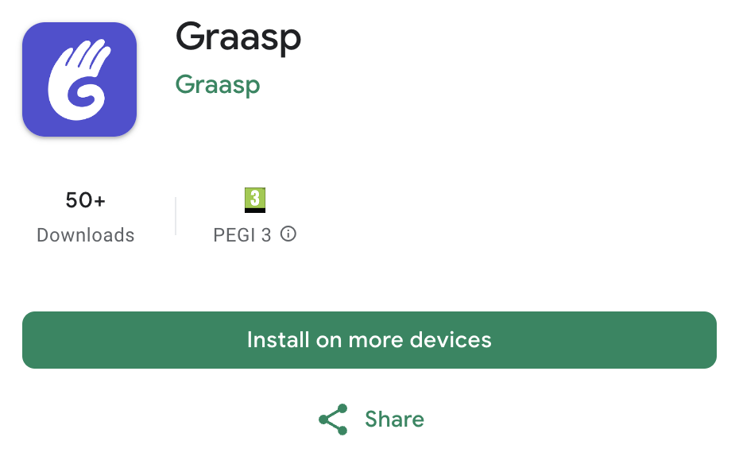

The latest updates outline various enhancements and additions across Graasp Builder, Graasp Player, Graasp Library, and Apps, including improvements to folder creation, licensing options, and a brand new OER information page! We also officially release the newest version of our mobile app! Read further for more information.

<!-- Everything below this will not be shown in the post overview -->
<!-- truncate -->

## Graasp Builder

- **Include a thumbnail when creating a Folder**: Enhance user experience by implementing a feature that allows users to upload or select thumbnails while creating folders, enabling them to personalize and visually distinguish their content within the platform.

- **Allow CC License Preview**: Enable users to preview different licensing options directly within the dialog before making a final selection, providing them with more information and flexibility in choosing the appropriate license for their content.
- **Improve Settings Page and Overall**: Conduct a comprehensive review of the settings page to streamline options, improve user interface elements, and enhance overall user experience, ensuring that users can easily access and manage their items' settings.

## Graasp Library

- **Add OER Info Page**: Introduce a dedicated <a href="https://library.graasp.org/oer">information page</a> within the Graasp Library highlighting the concept of Open Educational Resources (OER).

## Graasp Player

- **Display Folder Thumbnails on Shortcuts**: Display thumbnails of folders alongside shortcuts in the Graasp Player interface, allowing users to quickly identify specific folders based on visual cues.
- **Add Tooltips on Disabled Navigation Buttons**: Provide informative tooltips for disabled navigation buttons (chat and pin buttons) within the Graasp Player. We plan to provide more features to reader users, stay tuned!

## Apps

- **Prevent Same Choice in Quiz**: Implement a validation mechanism within the Quiz app to prevent users from adding the same choice for multiple questions, ensuring the integrity and accuracy of quiz responses.

## Graasp Mobile

We deployed the newest version of the mobile app which features:

- We renamed the application to Graasp (instead of Graasp Builder). We plan to group all planned features in one app!
- One can use the app without being signed in
- Integrated the Map view
- Add Bookmarked Tab
- Add Library Tab
- Integrated Chatbox

You can find it on <a href="https://play.google.com/store/apps/details?id=org.graasp.mobile&hl=en&gl=US">Google Play</a> or <a href="https://apps.apple.com/my/app/graasp/id1579895549">Apple Store</a>.

<!-- Generic message -->

We warmly welcome and encourage feedback from our users to continuously improve our platform. You can contact us by email [admin@graasp.org](mailto:admin@graasp.org) or by submitting an issue in this [Github repository](https://github.com/graasp/graasp-feedback).
