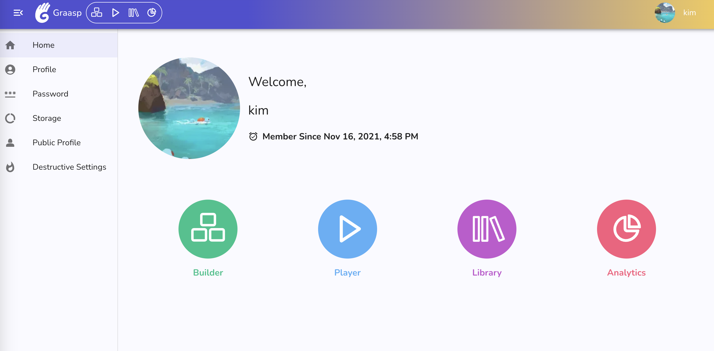
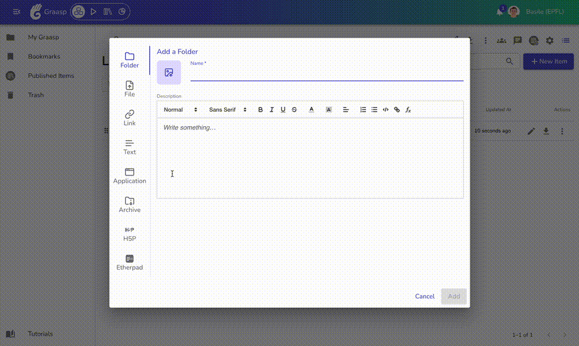

As the sunny days make their return, here is your new Graasp update, with a new link creation dialog and small fixes to boost your experience on the platform.

<!-- Everything below this will not be shown in the post overview -->
<!-- truncate -->

## Account

- Enhancement of the Graasp account home page: A concise summary of user data is now displayed, and users can update their avatars. Additional improvements will be implemented in the coming weeks!

## Builder

- The user interface for adding links has been updated and enhanced. There is now 3 ways you can display a link in Graasp:
  1. As a simple Hyperlink (blue underlined text), perfect for adding a discret reference
  2. As a fancy card, showing the website thumbnail and description
  3. When supported by the website you are adding, as an embedded iframe, allowing direct navigation from inside your learning unit. This option is also available when the lunk you are adding targets rich media like videos, who expose embedded media players.

- Update and improve the map functionality.

## Player

- Improvements to fix small usability issues
- Temporary removal of geolocation button

## Backend

- Implement endpoint to retrieve user actions for the dashboard view.
- Improve export actions to support CSV format.
- Enable URL updates for links while restricting HTML edits.
- Fix issue where copy suffix cannot increment beyond 3.

<!-- Generic message -->

We warmly welcome and encourage feedback from our users to continuously improve our platform. You can contact us by email [admin@graasp.org](mailto:admin@graasp.org) or by submitting an issue in this [Github repository](https://github.com/graasp/graasp-feedback).
