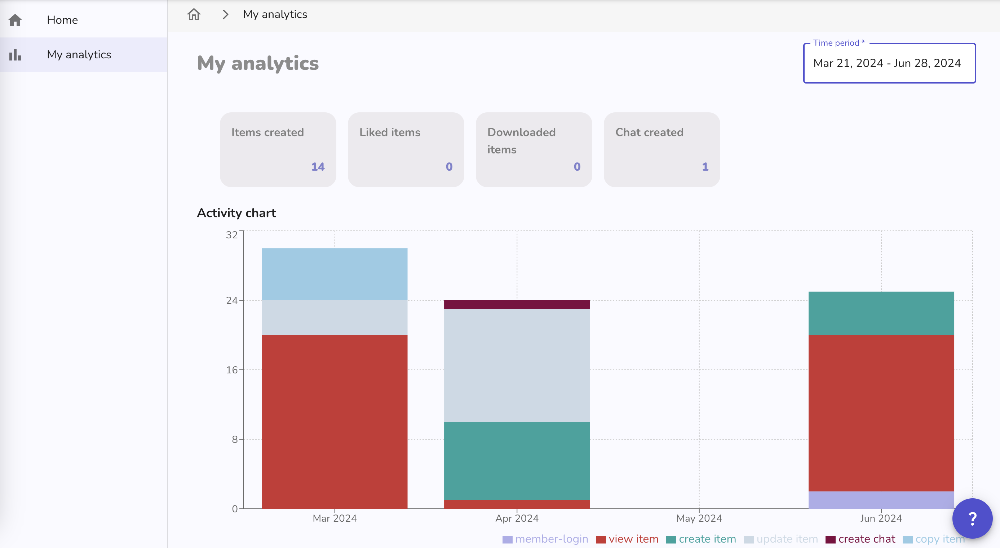
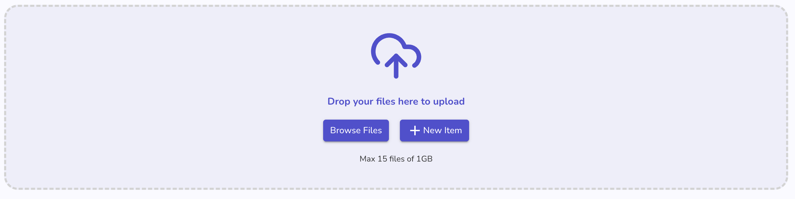
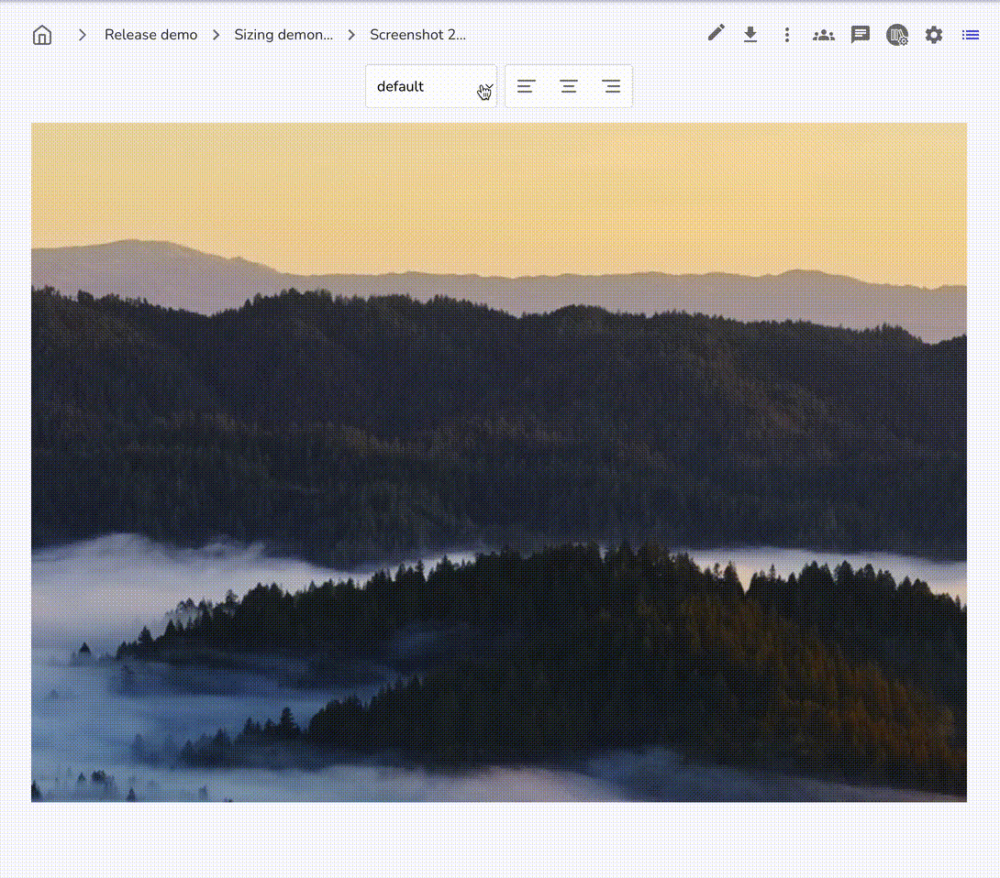
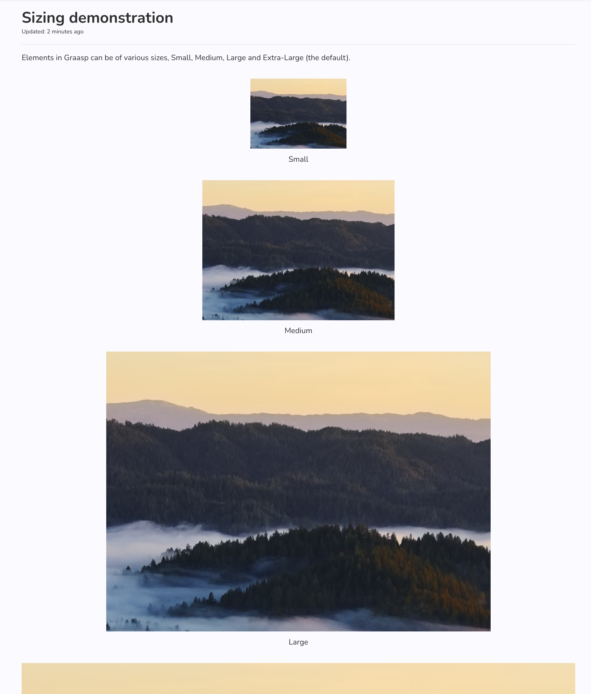

Summer is around the corner and the Graasp Team has been working on some hot updates for you. In this release, we've made some changes that will allow you to tailor your content just how you want it. Read further for more details!
<!-- Everything below this will not be shown in the post overview -->
<!-- truncate -->

## Account

- We improved the editing experience of your public profil. Go to [your profile page in Graasp Account](https://account.graasp.org/profile) and click the "Edit" button to start filling in your public profile. It will be shown in the library when you publish some resources for others to see.

## Analytics

- **Member Statistic Page:** We developed a dashboard to display the member statistics across the entire Graasp ecosystem. This tool will allow users to track their activity and engagement over time with visual representations such as graphs and charts. By providing insights into usage patterns, the dashboard helps users understand their involvement and productivity within the platform. Additional graphics and interactive features will be added soon to enhance the user experience and provide even deeper insights.

## Builder

- We improved the file dropzone and its notifications, and replaced the "Import ZIP/H5P" buttons. Uploading files should feel more snappy and the interface has been simplified for a more streamlined experience.

We added some settings to help you size your media with 5 pre-defined sizes, extra small, small, medium, large and extra large. By default all media is displayed as extra-large to best display it. But in case you would prefer it to be very small, or only medium, you now can set it to !

Below you can see some examples in the player, with images of different sizes and aligned using all possible values.

We also added the possibility to choose the alignment of the media, so you cna choose between left, right and centered. The caption of the item will also be aligned to the side you have chosen to display it as coherently as possible.

## Player

- Related to the improvements to the media sizing settings now available in the builder, the player will now display the media as intended. Feedback on these improvements in always welcome. Send us an email !
- We fixed an issue where navigating between different learning capsules in the player would crash the navigation on the left. Now, when this happens, you will be able to reload the page to get the navigation back. We have some better improvements planned, but this should fix the issue for the moment. Let us know by email if you encounter related issues.

## Backend

- Add update email endpoints (coming soon)
- Allow emails with long extension (ie. `.swiss`)
- Remove the possibility to link an existing member account to a pseudonimised item.

<!-- Generic message -->

We warmly welcome and encourage feedback from our users to continuously improve our platform. You can contact us by email [admin@graasp.org](mailto:admin@graasp.org) or by submitting an issue in this [Github repository](https://github.com/graasp/graasp-feedback).
