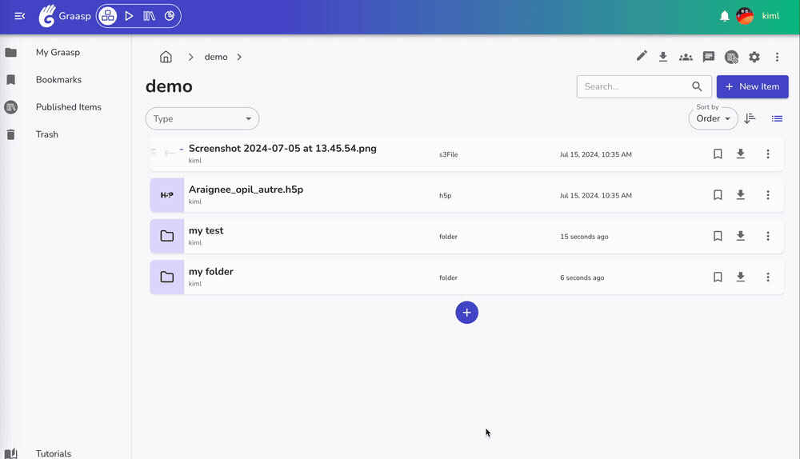

To complete July, we added back the functionalities to apply on many items. Also the Account platform and Quiz app got nice updates. Read further for more details!

<!-- Everything below this will not be shown in the post overview -->
<!-- truncate -->

## Account

- **Validate Email Page**: Show new email address in update page.
- **Translations**: Update translations for all relevant components and pages.
- **Dependencies**: Update dependencies to their latest versions.

## Builder

- **Multi-Operation Features**: Add back multi-operation functionalities for home, recycle bin, and folder screens.

  - **Click to select many items to move, copy or recycle**

- **Drag & Select many items**

- **Drag & Move many items in a folder**

- **Member Validation Warning Banner**: Due to a change of managing accounts in our database, we now validate members on sign up. Previously registered users are validated by default. New users might have to validate their email, otherwise a warning banner will notify them about validation requirements.
- **Visibility Change Modal**: Display a modal when changing the visibility of a published item.
- **Name Validation**: Ensure the name field is validated as a required value when adding an item.
- **Loading States**: Show loading states in bookmarks, published items, and recycled items sections.

## Apps

### Quiz

- **Retry Button for Fill in the Blanks**: Add a retry button for fill-in-the-blank questions.
- **Reset Selection on Retry**: Reset the user's selection when retrying multiple-choice questions.

## Backend

- **Publication State Calculation**: Move the computation of publication states to the backend.
- **Email Validation Restriction**: Restrict access for members who haven't validated their email, with an exception for legacy members who are validated by default.
- **Dependencies**: Update all backend dependencies to their latest versions.

<!-- Generic message -->

We warmly welcome and encourage feedback from our users to continuously improve our platform. You can contact us by email [admin@graasp.org](mailto:admin@graasp.org) or by submitting an issue in this [Github repository](https://github.com/graasp/graasp-feedback).
