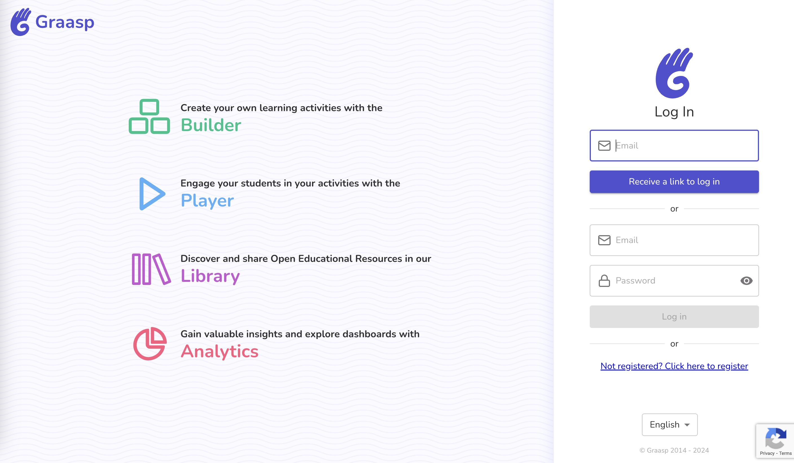
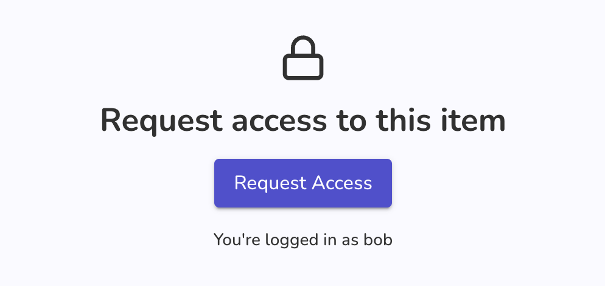
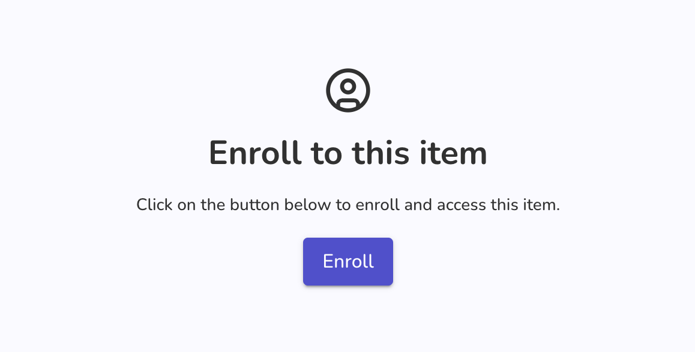
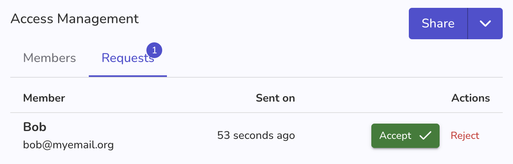

Now that summer is over, we are back with awesome updates such as **Membership requests**, interface improvements, bug fixes and support for more file types. Read on for more !

<!-- Everything below this will not be shown in the post overview -->
<!-- truncate -->

## Auth

We updated the interface to display the 4 available services Graasp offers. This change will be followed with a new interface to reset a password.

## Player

### Increased audio file type support

| format              | support              | share of items |
| ------------------- | -------------------- | -------------- |
| audio/mpeg          | ✅ already supported | 78%            |
| audio/x-m4a         | 🆕 support added     | 10%            |
| audio/mp4           | ✅ already supported | 5%             |
| audio/x-wav         | ✅ already supported | 2.5%           |
| audio/wav           | ✅ already supported | 1%             |
| audio/mp3           | ✅ already supported | 1%             |
| audio/ogg           | 🆕 support added     | 1%             |
| audio/vnd.dlna.adts | 🆕 support added     | < 0.5%         |
| audio/x-flac        | 🆕 support added     | < 0.05%        |
| audio/x-stm         | ❌ no support        | < 0.05%        |
| audio/x-aiff        | ❌ no support        | < 0.05%        |
| audio/x-hx-aac-adts | ❌ no support        | < 0.05%        |
| audio/aac           | 🆕 support added     | < 0.05%        |
| audio/flac          | 🆕 support added     | < 0.05%        |
| audio/midi          | ❌ no support        | < 0.05%        |
| audio/x-ms-wma      | ❌ no support        | < 0.05%        |

- Limit platform usage for guest accounts

## Builder

### Membership Request

We’ve just introduced a **Membership Request** feature that makes it easier for users to access certain items within our platform. Here's how it works:

- **Requesting Access to Restricted Items:**
  If a user tries to access an item that is restricted (i.e., they don’t have permission), they will now see an option to request access. When a user submits this request, it will be sent to the admin for approval. The admin can then accept or reject the request, determining whether the user will be granted access. The admin can further increase the access level for this user if needed.

- **Automatic Enrollment for Pseudonymized Items:**
  For items that are set to pseudonymized, users can self-enroll directly without needing approval.

This new feature provides more flexibility for users seeking access and gives admins control over who can view or interact with restricted content.

In the process we've also simplified the access management section to group together authorized users, authenticated users and invitations! You'll also find the requests tab in the same section.

Additionally, we've also improved Graasp Builder with:

- Update icons to fit the new design
- Add a helper text in the publication page that reminds users they can use the "Enter" key to quickly create tags.
- Limit platform usage for guest accounts

## Account

- Add a not-found page
- **Support Arabic**: users who select the arabic language will now enjoy a right-to-left interface. Feedback welcome.
- Small bug fixes and translation updates.

## Analytics

- Fix a small issue related to how actions are counted in the interface.

## Apps

- **Quiz**: improve player view

## Miscellaneous bug fixes

- **Etherpad export**: It is now possible to export an etherpad document.
- Small fixes and updates.
- Backend maintenance

## Backend

- Add freeze and disable for item login.

<!-- Generic message -->

We warmly welcome and encourage feedback from our users to continuously improve our platform. You can contact us by email [admin@graasp.org](mailto:admin@graasp.org) or by submitting an issue in this [Github repository](https://github.com/graasp/graasp-feedback).
