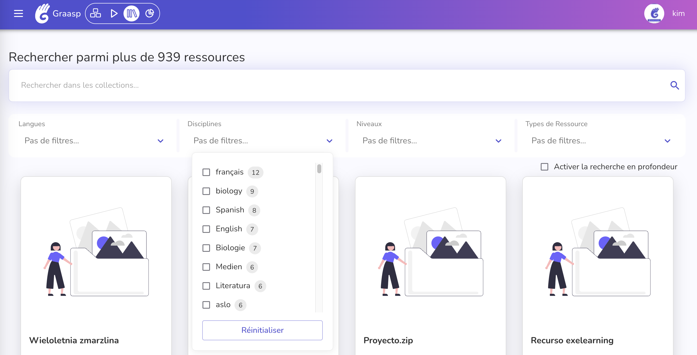
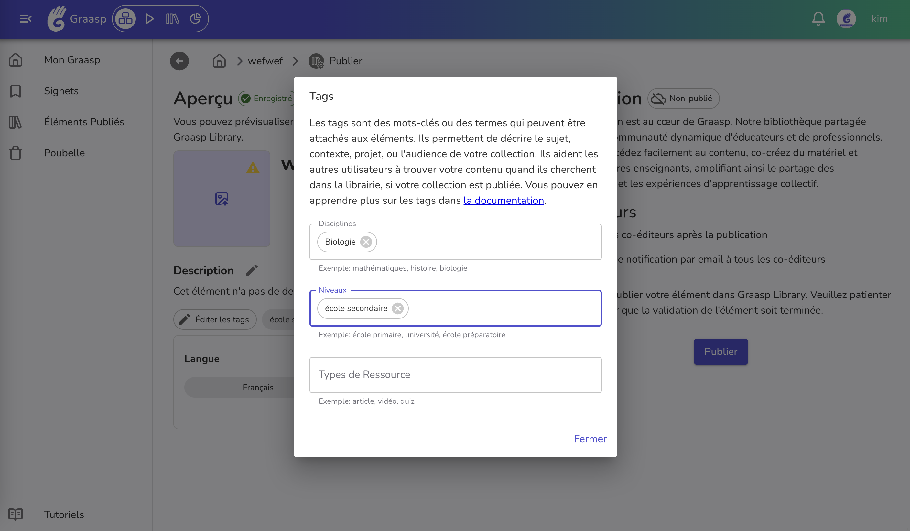

For the first update of 2025, new features include a "new folder" button, tag-based content organization, and updated translations, alongside fixes for the Quiz app and backend improvements.

<!-- Everything below this will not be shown in the post overview -->
<!-- truncate -->

## Personalized Tags and Filters

We improved our categories system by using personalized categories, that we call tags. Those are split into 3 categories: discipline, level and resource type. You can find the tags in Builder (library page) and Library.

If your items already had tags, most of them have been migrated to this new system safely in the discipline category. Don't hesitate to tweak your tags to better fit the available categories!

[You can find detailed information about tags here](https://graasp.github.io/docs/user/library/tags/).

Below you can find our usual update breakdown for each platform:

## Builder

- **Update translations**: Update translations for Arabic, Italian, Spanish and French language.
- **Introduce a new folder button**: Add a button that allows users to create new folders for organizing their items or content.
- **Replace categories with tags**: Transition from using categories to tags for more flexible and granular content classification.

## Library

- **Implement the new tag system**: Enable the use of tags for organizing and filtering content, with resource types integrated into search to improve discoverability.

## Apps

- **Quiz**: Prevent infinite loop for readers and network errors on legacy data

## Backend

- **Enable POST and PATCH methods for item folders**: Allow the creation and updating of item folders via specific backend API endpoints.
- **Integrate tags with Meilisearch**: Replace category-based indexing with tag-based indexing in Meilisearch and perform necessary data migration.
- **Add item in app action**: Include item data in an app action on export.
- **Remove deprecated Creative Commons license values**: Remove outdated Creative Commons license options from the backend to maintain compliance and accuracy.
- **Return no content when no avatar is available**: Modify the backend to return an empty valid response when there is no avatar associated with a user.

## Client (work in progress)

- **Add landing page**: Create a new landing page for the application with small adjustments, with dedicated pages for the Terms of Service, Disclaimer, Privacy Policy and Features.
- **Add language detector**: Implement a feature to automatically detect and set the user's language preference.
- **Add preview mode**: Introduce a preview mode for users to see changes before applying them.
- **UI: Add Storybook**: Integrate Storybook for building and testing UI components in isolation.
- **Enhance login and registration forms**: Add new form headers and integrate `react-hook-form` for handling validation.
- **Resolve integration and authentication issues**: Fix client-side authentication, proxy configuration, and integration-related problems.
- **Fix reCAPTCHA issues**: Add reCAPTCHA environment variables, move reCAPTCHA to the auth layout, and fix script loading in HTML.
- **Optimize CI and deployment setup**: Implement permissions in CI, update build scripts, and adjust deployments to follow proper installation steps.

As we step into 2025, the team wishes you a year filled with new opportunities, growth, and happiness!

<!-- Generic message -->

We warmly welcome and encourage feedback from our users to continuously improve our platform. You can contact us by email [admin@graasp.org](mailto:admin@graasp.org) or by submitting an issue in this [Github repository](https://github.com/graasp/graasp-feedback).
