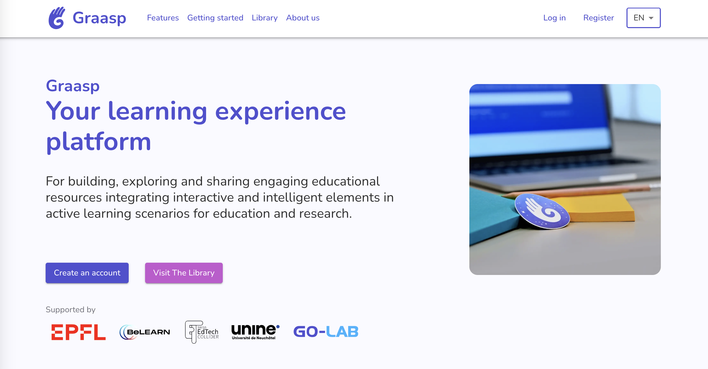

Since last year, the Graasp team has been working on simplifying the code base to unify most of its ecosystem. Additionally, a new layout for Library has been unveiled. Read further for details.

<!-- Everything below this will not be shown in the post overview -->
<!-- truncate -->

## Library Cards

We improved our collection cards in Library to include tags and bigger space for the description. For those that didn't chose a thumbnail for their collections, we added some hint of colors! Let us know what you think of this new design.

## Unique domain: graasp.org

For a better management of our platform, we moved our links to a unique domain: [graasp.org](https://graasp.org).
You can discover our new [landing page](https://graasp.org) with more details about us and the complete Graasp ecosystem! You can also learn more about [specific features](https://graasp.org/features) with our [tutorials page](https://graasp.org/support). Let us know if you wish other tutorials to help you get started!

:::warning

All previous links are still valid, but should be updated for better compatibility.

:::

## Apps

- **Quiz**:
  - update german translations
  - fix weird spacing in Fill In the Blanks questions
  - allow break lines in Fill In the Blanks questions
  - remove automatic uppercase in multiple choices questions

## Backend

- Add endpoints for creating and modifying links, allowing to update a link in-place.
- Add endpoints for creating and modifying documents
- Add an endpoint to get collections by most likes
- Fix analytics endpoint

<!-- Generic message -->

We warmly welcome and encourage feedback from our users to continuously improve our platform. You can contact us by email [admin@graasp.org](mailto:admin@graasp.org) or by submitting an issue in this [Github repository](https://github.com/graasp/graasp-feedback).
