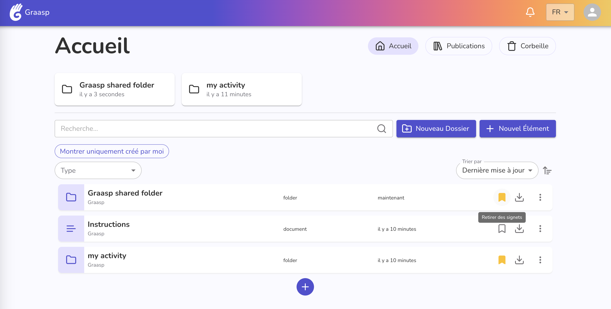
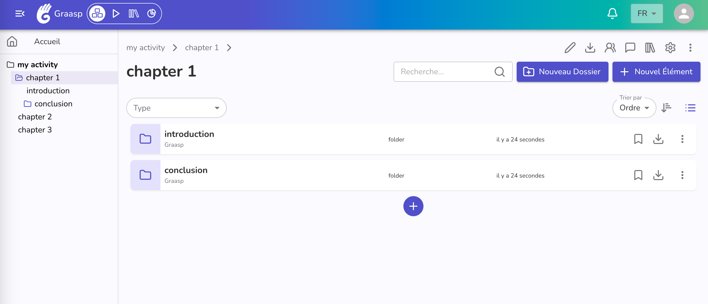

During the last weeks, the Graasp team has work diligently to bring you a new home experience. Read further for more details.

<!-- Everything below this will not be shown in the post overview -->
<!-- truncate -->

## Home Page & Navigation

With this update, we've redesigned the interface of your personal homepage for a more streamlined experience. It now displays, just like before, the items shared with you and your bookmarked content, but with enhanced accessibility. We hope this update makes it even easier to access the items you use most frequently!

Additionally, we've revamped the side menu of the Builder view. It now features the same navigation tree as in the Player, providing a clear view of your item's structure and a better understanding of the hierarchy of your content.

**Bullet list of the improvements:**

- Display accessible items and bookmarks directly on the home page for easy access.
- Transform the drawer content into tabs in the right-hand side corner of the home page for a clearer navigation.
- Include settings and tutorials within the member drop-down menu for easier access. Replace the “Profile” option with “Home” in the user menu popup for clearer options.
- Show item tree navigation in the builder to enhance the user experience when working with complex items.

Don't hesitate to share your feedback with us, so we can improve even more your experience with Graasp!

In addition, note those major new features:

- A new option allows reader to write within an etherpad document (you can find the option when creating or editing an etherpad).
- Links can have their URL changed.

## Bug Fixes & Updates

- Resolve app resizing issues.
- Prevent membership requests from being made for hidden items.
- Update some French translations to improve clarity and inclusivity.
- Address issues with notifications and login errors to ensure users are notified correctly and can log in without problems.
- Fix websockets-related issues to maintain stable real-time communication and connectivity.
- Ensure the player interface is scrolled to the top of the page on navigation to improve the user’s ability to find new content after navigating.
- Fix the app and link description update process, ensuring changes to descriptions are applied and displayed correctly.

<!-- Generic message -->

We warmly welcome and encourage feedback from our users to continuously improve our platform. You can contact us by email [admin@graasp.org](mailto:admin@graasp.org) or by submitting an issue in this [Github repository](https://github.com/graasp/graasp-feedback).
