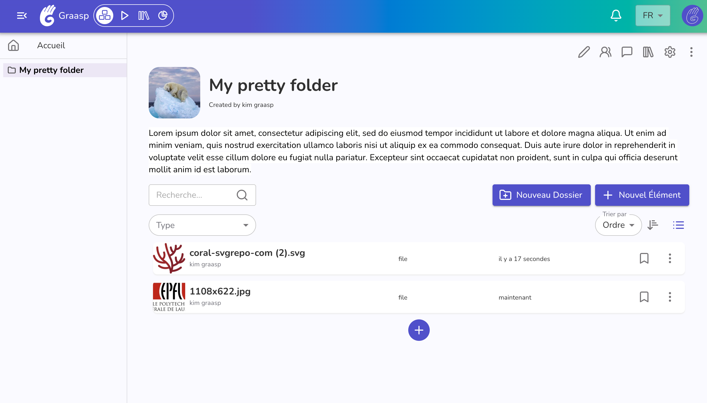
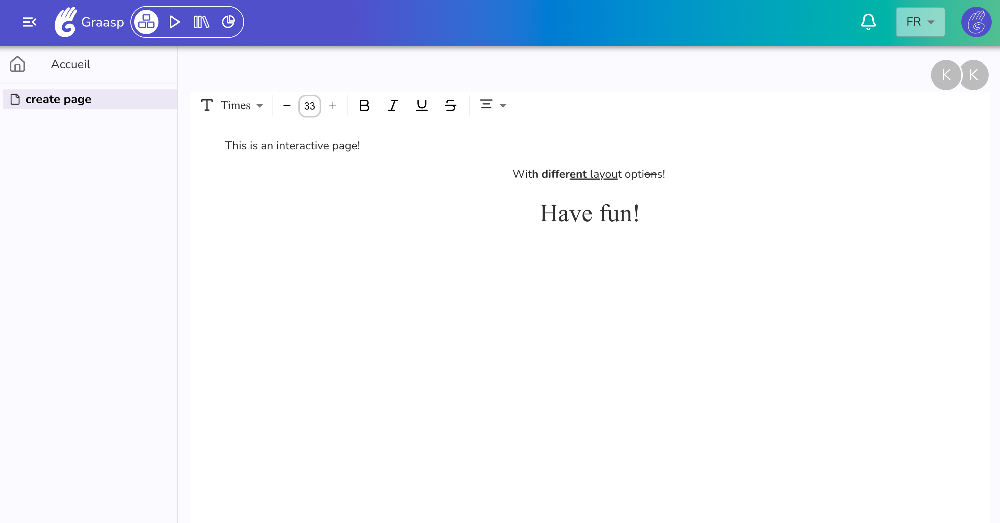

The Graasp team continues to improve the platform in different directions, focusing on consolidating the foundations, from the interfaces to server optimizations. You can find a more detailed list of the changes below.

<!-- Everything below this will not be shown in the post overview -->
<!-- truncate -->

## Workflow improvement to copy from the library

The copy mechanism has been relocated to Builder, enabling dynamic feedback if the user is not currently logged in. This change helps provide immediate guidance and improves the overall user experience. A tutorial explaining how to use this feature is available [here](https://graasp.github.io/docs/user/library/copy).

## Builder folder layout

The layout of a folder in Builder has been slightly changed for a more responsive layout, showcasing the thumbnail for a more appealing view. The layout is based on the Player's layout.

## Pages (Beta)

We are developing a new interactive interface to enhance the user experience. Instead of designing each element individually, the goal is to create entire pages as a whole, and as previewed by the readers. The interface will continuously expand with new element types to fully support all Graasp features. The implementation embedded collaboration by default, allowing multiple writers to edit the content.
If you’d like to test this feature, please email us at beta@graasp.org. Your feedback is greatly appreciated!

:::warning
The new "Page" interface is currently in beta. Please note that any data saved may be lost in the future. We recommend using this feature only for testing purposes or keeping a backup of your work, either by saving your text locally or in a separate document within Graasp.
:::

## Other changes

As always we are committed to making the platform faster and more reliable for all our users.
With this update we improved on the following:

- Improve error messages for apps
- Simplify implementation for shortlinks (frontend)
- Various code refactor for client (frontend)

<!-- Generic message -->

We warmly welcome and encourage feedback from our users to continuously improve our platform. You can contact us by email [admin@graasp.org](mailto:admin@graasp.org) or by submitting an issue in this [Github repository](https://github.com/graasp/graasp-feedback).
