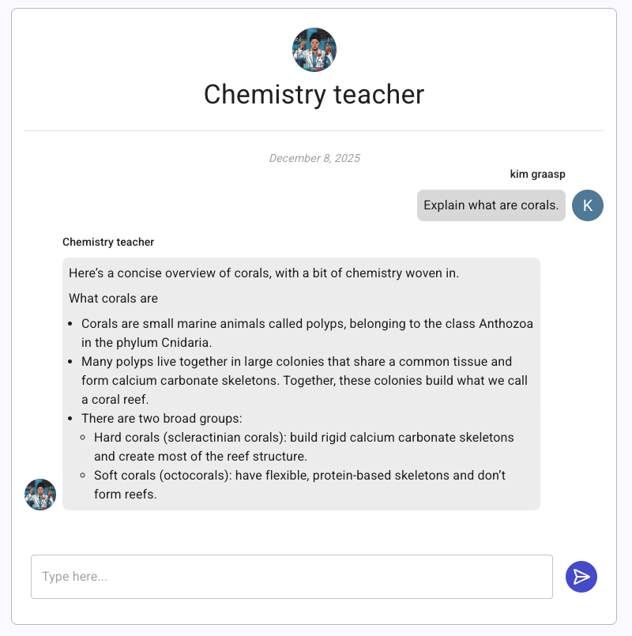

We're reaching the end of the year, and we’ve been hard at work improving Graasp’s chatbot app and overall performance. Read further for more details.

<!-- Everything below this will not be shown in the post overview -->
<!-- truncate -->

---

## 🤖 Chatbot 2.0 — A Major Upgrade

Our chatbot has received a full layout redesign along with powerful new features:

- Add a custom **avatar**
- Provide **conversation suggestions** to guide users
- Overall cleaner and more intuitive interface

Want to learn more? Check out the full documentation [here](/user/apps/chatbot).

---

## 🏠 A Fresh New Homepage

We’ve rolled out a major update to the Graasp homepage.  
While more refinements are coming soon, we believe this new version better reflects our mission and offers a clearer experience for our audience.

---

## 🌐 Single Origin Improvements

The backend API now operates under a single origin: **graasp.org/api**. This simplifies development and improves overall platform consistency. It shouldn't have break anything. If you notice any problem, please contact us.

We plan to move the Library to **graasp.org/library** as well.

---

## ⚙️ Backend Optimizations

We’ve implemented several performance and stability improvements:

- Better environment variable handling for **H5P** and **shortlinks**
- Faster **app data** and **parents** endpoints
- More reliable **membership updates**

These updates ensure smoother and faster interactions across the platform.

---

## 🛠️ Admin Enhancements

For administrators, we’ve added:

- Support for **HTML emails**
- Minor fixes for **publications**
- Maintenance setup improvements
- Various other refinements

---

Thanks for being part of the Graasp community! More updates are on the way—stay tuned.

<!-- Generic message -->

We warmly welcome and encourage feedback from our users to continuously improve our platform. You can contact us by email [admin@graasp.org](mailto:admin@graasp.org) or by submitting an issue in this [Github repository](https://github.com/graasp/graasp-feedback).
