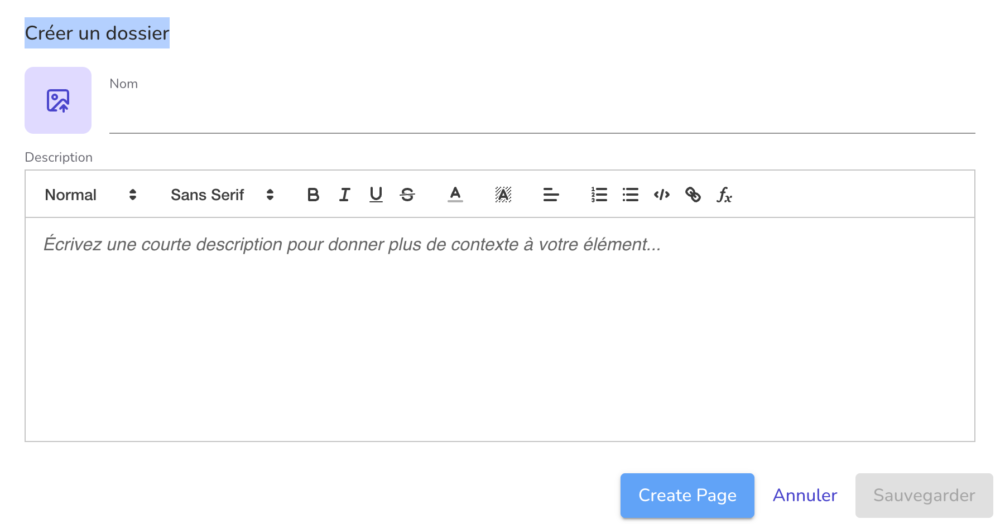

# Pages (Beta) in Graasp

The **Pages** feature is a new addition to **Graasp**, providing a rich-text, WYSIWYG editing experience powered by [Lexical](https://lexical.dev/) from Meta. Designed for flexibility and collaboration, Pages let you create fully formatted documents directly inside your folders.

:::warning[Beta Notice]
Pages are currently in beta. Saved data **might be deleted** in future updates. Please use this feature only for testing purposes and **keep backups** of important content.
:::

---

## What Are Pages?

Pages are interactive, rich-text documents. Unlike standard items, Pages offer full-page editing using a visual editor—what you see is what you get.

---

## Key Features

### ✏️ Text Styling

- Font family selection
- Font size adjustment
- **Bold**, _Italic_, **_Underline_**, Strikethrough
- Paragraph alignment (left, center, right, justify)

### 🧾 Rich Content Structure

- Links as card, embed or text

### 🤝 Real-Time Collaboration

Pages support **real-time collaborative editing** via [Yjs](https://yjs.dev/). Multiple users can work on the same document simultaneously, with changes synced live. Perfect for team notes, collaborative writing, and documentation.

---

## How to Access Pages (Beta)

To try Pages while in beta:

1. Go to the **Builder**.
1. Go inside a folder.
1. Click on the **New folder** button.
1. Click **three times** on the folder title ("Create a folder").
1. A new button will appear: **"Create page"**.
1. Click it to create and open your Page.

:::warning[Beta Notice]
Page content might not be saved permanently. Always keep a backup (e.g., paste your text in a regular document item or save it locally).
:::

---

## Known Limitations

- Occasional syncing issues may occur during collaborative editing.

---

## Feedback & Bug Reporting

We appreciate your help in testing this feature!  
Please report any bugs or suggestions to: [beta@graasp.org](mailto:beta@graasp.org)

---

## Coming Soon

Planned enhancements include:

- Bullet and numbered lists
- Blockquotes
- Code blocks
- Horizontal rules
- Hyperlinks
- Inline code formatting
- Headings (H1, H2, H3, etc.)
- Text color & background highlighting
- Image and video embedding
- Export options (PDF, HTML)
- Page sharing and publishing
- Layout tools and custom blocks
- And more

---

Thanks for testing Pages and helping us improve Graasp!
