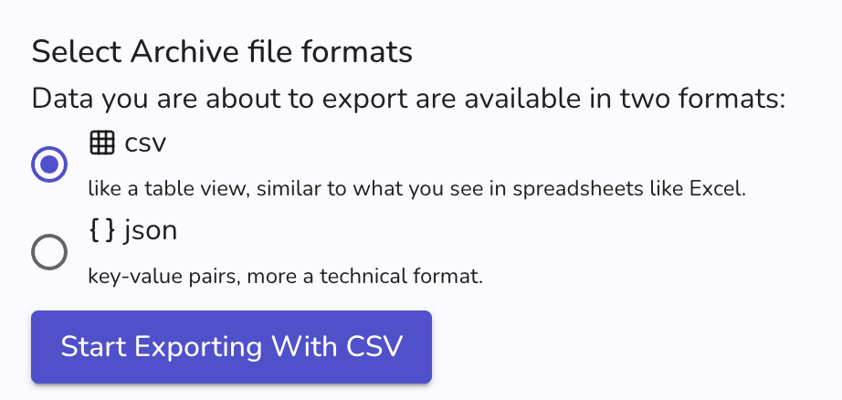

Below are the latest changes deployed on [Graasp Staging](https://builder.stage.graasp.org).

:::warning[Important notes]

- You might need to create a new account on [the staging environnement](https://auth.stage.graasp.org) since the staging environment uses a different database as production's.
- Use a different browser or an incognito session to prevent cookie collision.

:::

<!-- Everything below this will not be shown in the post overview -->
<!-- truncate -->

## Graasp Analytics

- Allow users to export actions as csv files.

## Backend

- Fix a bug regarding getting a lot of tags
- Update of libraries

## Graasp Mobile (1.5.0)

- The space between elements in the player view has been reduced, and titles are now better aligned
- Item list options have been improved
- A QR code display feature has been added, available in the item list options
- The sharing feature has been simplified to share the builder view
- The message in the player for folders containing only folders has been improved

<!-- Generic message -->

We warmly welcome and encourage feedback from our users to continuously improve our platform. You can contact us by email [admin@graasp.org](mailto:admin@graasp.org) or by submitting an issue in this [Github repository](https://github.com/graasp/graasp-feedback).

:::info[For editors and developers]
Feel free to update this text before we officially release it using the "Edit this page" button at the end of the article
:::
