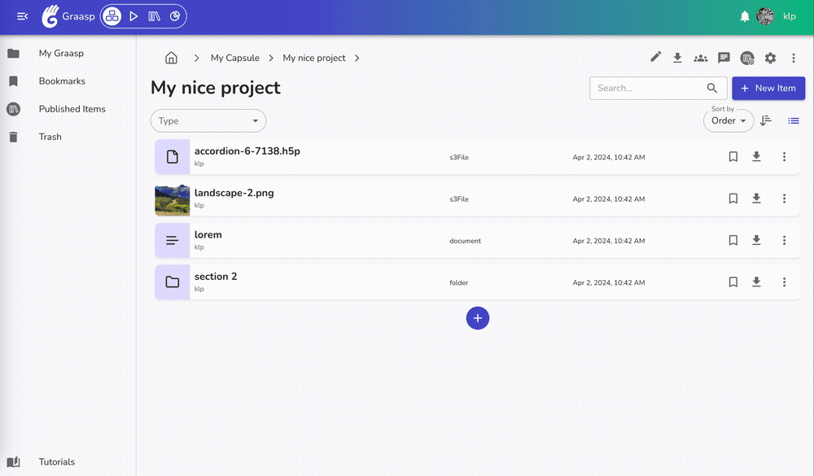
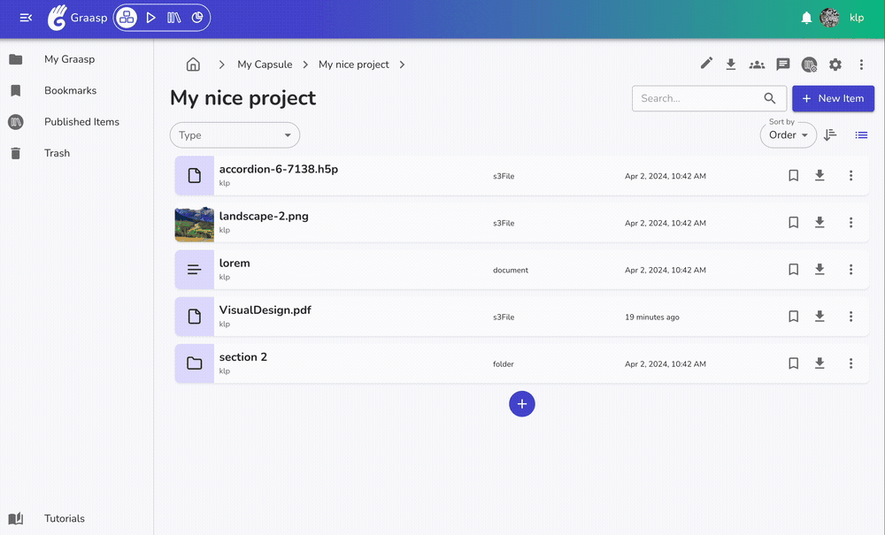
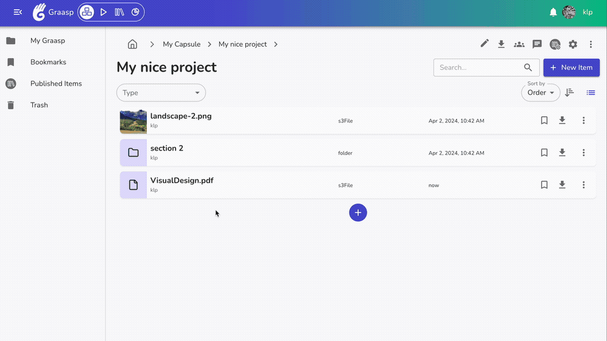

Below are the latest changes deployed on [Graasp Staging](https://builder.stage.graasp.org).

:::warning[Important notes]

- You might need to create a new account on [the staging environnement](https://auth.stage.graasp.org) since the staging environment uses a different database as production's.
- Use a different browser or an incognito session to prevent cookie collision.

:::

<!-- Everything below this will not be shown in the post overview -->
<!-- truncate -->

## Builder

We revamp the item list view for a more attractive design, it will be refined step by step given the feedback. This redesign comes with the new features:

- **Drag & upload files in between items**

- **Drag & upload files in items**

- It's finally here: **moving an item into a folder!**

:::warning[Operations on multiple items]
The multiple items operations have been disabled for now, but will come back in a very near future. Let us know if it's a key feature you need!
:::

<!-- Generic message -->

We warmly welcome and encourage feedback from our users to continuously improve our platform. You can contact us by email [admin@graasp.org](mailto:admin@graasp.org) or by submitting an issue in this [Github repository](https://github.com/graasp/graasp-feedback).

:::info[For editors and developers]
Feel free to update this text before we officially release it using the "Edit this page" button at the end of the article
:::
