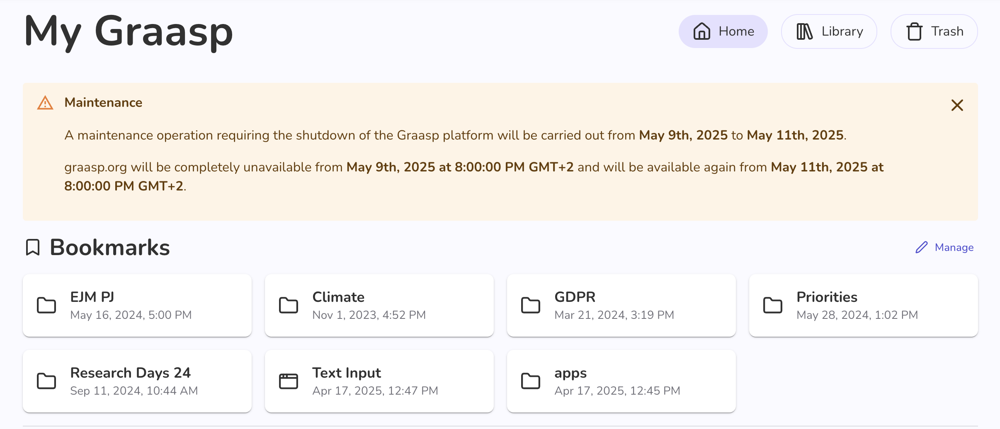

Below are the latest changes deployed on [Graasp Staging](https://builder.stage.graasp.org).

:::warning[Important notes]

- You might need to create a new account on [the staging environnement](https://auth.stage.graasp.org) since the staging environment uses a different database as production's.
- Use a different browser or an incognito session to prevent cookie collision.

:::

This update introduces helpful interface improvements—like maintenance messages and clearer translations, alongside backend enhancements for better performance, stability, and up-to-date infrastructure. Read further for details.

<!-- Everything below this will not be shown in the post overview -->
<!-- truncate -->

## Maintenance notice

To keep you informed and avoid surprises, the app now displays a clear message delivering maintenance dates when the system will undergo updates or temporarily be unavailable. This ensures that you’re aware of any planned downtime or disruptions before they affect your workflow, helping you plan accordingly and stay in control. It’s a small but important step toward improving transparency and communication with our users.

## Interface (details)

- A message will now appear when the system is under maintenance.
- Bookmarks on the home page can be removed by clicking on the "Manage" button.
- You can now download items directly from the item menu.
- Some missing translations were added to make actions clearer.
- developer: The documentation (instructions for using the app) has been updated.

## Backend (details)

- A new feature was added so the system can report when it's in maintenance mode.
- Improved recovery during item reordering.
- Updates dependencies.

<!-- Generic message -->

We warmly welcome and encourage feedback from our users to continuously improve our platform. You can contact us by email [admin@graasp.org](mailto:admin@graasp.org) or by submitting an issue in this [Github repository](https://github.com/graasp/graasp-feedback).

:::info[For editors and developers]
Feel free to update this text before we officially release it using the "Edit this page" button at the end of the article
:::
