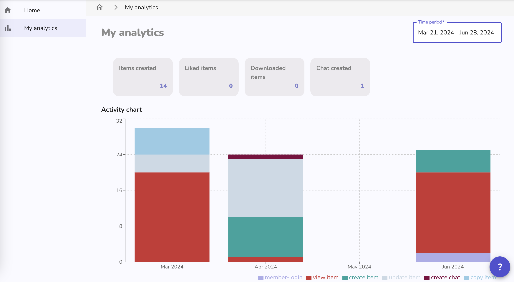

Below are the latest changes deployed on [Graasp Staging](https://builder.stage.graasp.org).

:::warning[Important notes]

- You might need to create a new account on [the staging environnement](https://auth.stage.graasp.org) since the staging environment uses a different database as production's.
- Use a different browser or an incognito session to prevent cookie collision.

:::

<!-- Everything below this will not be shown in the post overview -->
<!-- truncate -->

## Account

- Improve edition of public profile

## Analytics

- **Member Statistic Page:** We developed a dashboard to display the member statistics across the entire Graasp ecosystem. This tool will allow users to track their activity and engagement over time with visual representations such as graphs and charts. By providing insights into usage patterns, the dashboard helps users understand their involvement and productivity within the platform. Additional graphics and interactive features will be added soon to enhance the user experience and provide even deeper insights.

## Builder

- Improved dropzone and its notifications, and replace import ZIP/H5P buttons.

## Player

- Fix problem with navigation with links.
- Fix image an caption sizing.

## Backend

- Add update email endpoints (coming soon)
- Allow emails with long extension (ie. swiss)

<!-- Generic message -->

We warmly welcome and encourage feedback from our users to continuously improve our platform. You can contact us by email [admin@graasp.org](mailto:admin@graasp.org) or by submitting an issue in this [Github repository](https://github.com/graasp/graasp-feedback).

:::info[For editors and developers]
Feel free to update this text before we officially release it using the "Edit this page" button at the end of the article
:::
