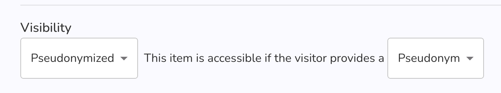

Below are the latest changes deployed on [Graasp Staging](https://builder.stage.graasp.org).

:::warning[Important notes]

- You might need to create a new account on [the staging environnement](https://auth.stage.graasp.org) since the staging environment uses a different database as production's.
- Use a different browser or an incognito session to prevent cookie collision.

:::

<!-- Everything below this will not be shown in the post overview -->
<!-- truncate -->

## Small fixes

This week we fixed an annoying issue where users being already logged in, but accessing the platform from `graasp.org` and the "SignIn" button would get stuck on a "You are being redirected" screen where nothing would happen.

If you are signed in and access Graasp from the homepage (graasp.org) via the signIn button you should now be greeted with the following screen (but with your account name instead 😉):

## AutoLogin feature

This one might for the more technically inclined, or for users having specific needs.
We added a functionality where with a single url, you can log in a user onto a pseudonimysed account.

For this to work, you will need to create an item and allow pseudonymised access using username only (see the sharing page for your item).

With this in place, you can share a URL with the target user. This URL will be the following:

`https://player.graasp.org/:rootId/:itemId/autoLogin?username=bob`

You can get the first part of the url by viewing the item in the player. Simply copy the address and append `/autoLogin?username=` and then the username your would like your user to take. (For experiences users, the name should probably be url-encoded).

<!-- Generic message -->

We warmly welcome and encourage feedback from our users to continuously improve our platform. You can contact us by email [admin@graasp.org](mailto:admin@graasp.org) or by submitting an issue in this [Github repository](https://github.com/graasp/graasp-feedback).

:::info[For editors and developers]
Feel free to update this text before we officially release it using the "Edit this page" button at the end of the article
:::
