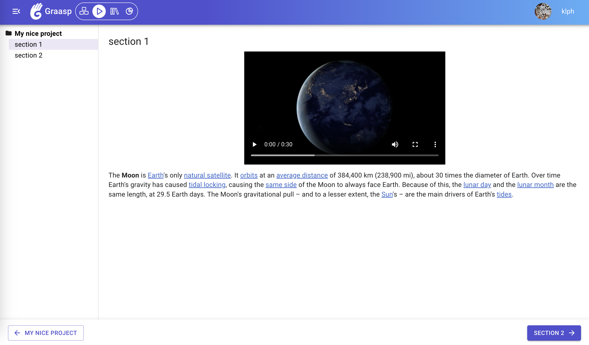

<!-- TODO: Need to add a summary here ! -->

<!-- truncate -->

Below are the latest changes deployed on [Graasp Staging](https://builder.stage.graasp.org).

:::warning[Important notes]

- You might need to create a new account on [the staging environnement](https://auth.stage.graasp.org) since the staging environment uses a different database as production's.
- Use a different browser or an incognito session to prevent cookie collision.

  :::

The latest updates to Graasp bring numerous improvements across its modules. Highlights include a <strong>navigation between sections in Graasp Player</strong>, a new map layout mode and dropzone displays in Graasp Builder, resolved avatar crop modal issues in Graasp Account, and significant enhancements to the Sketchfab. Read further to see the full details!

<!-- truncate -->

## Graasp Player

- Introducing a navigation bar to consume content linearly

## Graasp Builder

- Introducing the new map layout mode, providing users with an alternative view for organizing content, enhancing their overall experience.
- Incorporating dropzone display for empty folders, offering clearer visual cues within the interface, improving user navigation.

## Graasp Account

- Resolving issues related to the avatar crop modal to enhance user customization and ensure a seamless profile visual update experience.

## Graasp Apps

- Sketchfab:
  - Adding Spanish translations to broaden accessibility and inclusivity.
  - Introducing an analytic view feature for insightful data insights.
  - Migrating to TypeScript for improved codebase maintainability.
  - Enabling users to save actions performed while interacting with 3D models in the player view, enhancing sharing capabilities.

## Graasp Library

- Enhancing privacy by hiding the parent items of private content.
- Adding translations to broaden accessibility for users with different language preferences.

# General

- Implementing optimizations to streamline analytic traces for smoother platform performance and an enhanced user experience overall.

<!-- Generic message -->

We warmly welcome and encourage feedback from our users to continuously improve our platform. You can contact us by email [admin@graasp.org](mailto:admin@graasp.org) or by submitting an issue in this [Github repository](https://github.com/graasp/graasp-feedback).

:::info[For editors and developers]
Feel free to update this text before we officially release it using the "Edit this page" button at the end of the article
:::
