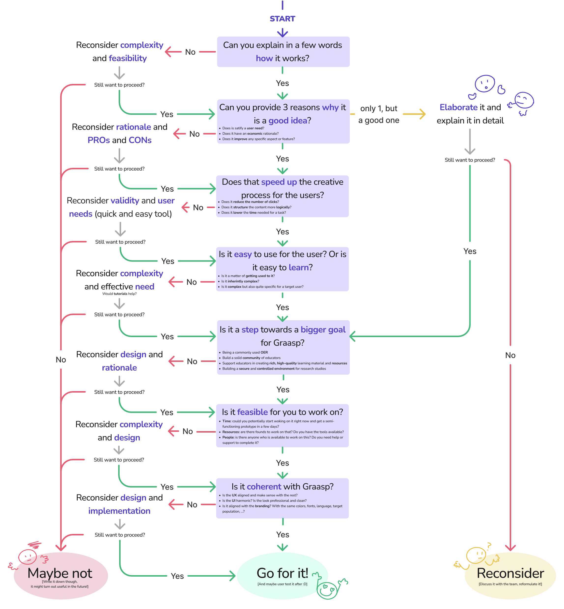

# Should we implement this ?

Quick Decision Tree to ease the decision process on a user and brand-centred point of view.

[Download the pdf version](./graaspDesignTree.pdf)

This decision tree is designed with a focus on both **user** and **brand needs**, aiming to **support informed decision-making** when considering new ideas for Graasp. It provides a semi-structured approach to **evaluating ideas**, guiding you through various considerations such as complexity, user experience, alignment with goals, and feasibility.

:::tip
You can use it in different ways: during **team discussions**, follow the branches and answer the questions collaboratively to assess the validity of an idea and justify decisions. Otherwise, it can be a **personal guide**, prompting you to consider each aspect individually and write down your answers, while analyzing potential ideas.
:::

In both scenarios, this decision tree is meant to encourage you to make informed decisions that align with the goals of Graasp, moving from a feature- centred view to a more user-centred one.
