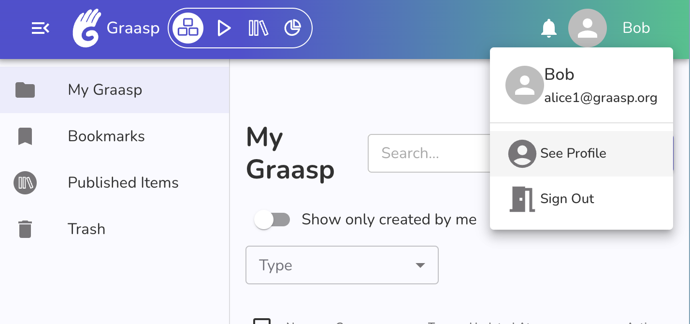

# Email address

On the Graasp platform, your email is used to log in (via magic link) and receive notifications (you can disable notifications in your profile).

## What email is used with my Graasp account ? {#email-used}

You can find which email is used with your current Graasp account by clicking your name in the top right corner of the page. The popup should display your name, avatar picture and email address like the image below.

If you do not see an email address, this means you are logged in with a pseudonymised (or guest) account. These account have limited abilities and can only access content from the element they were created on. Lag out og this account and log in with your full Graasp account if you have one. If you do not have a Graasp account yet, you can create one with just an email in a few minutes. See [create a Graasp account](../create-account) for more information.

## How to change my email ? {#change-email}

You can change the email used with your Graasp account on [the Graasp Account profile page](https://account.graasp.org/profile).

1. Log in to Graasp using your email or email + password if you have set one.
   1. If you do not have a password set and you do not have access to the email you used in Graasp please contact us (contact information at the end of this page).
2. Click on your account name in the top right corner of the screen and select "See Profile" in the popup.
  
3. Select "Profile" in the left navigation menu.
4. Click on the "Edit" button in your personal information section
5. Fill in the new email you would like to use.
6. Save the changes.
  
   Here is a recap of the steps 3 to 6:
   

7. An email will be sent to your new email address.
   1. If you do not get an email, it might mean you tried to use an email that is already registered with Graasp.
8. Click on the link sent in the email.
9. Click on the "Validate" button on the page.
   1. If you get an error ensure you are using a fresh link. Links last 24 hours. If your link is older, please update your email again in your profile and use the new link that you will receive.
   2. Ensure you did not create a Graasp account with your new email.
10. Once validation is successful you can log in with your new email. Your old email will receive a last message letting you know that you moved your account to your new email.
