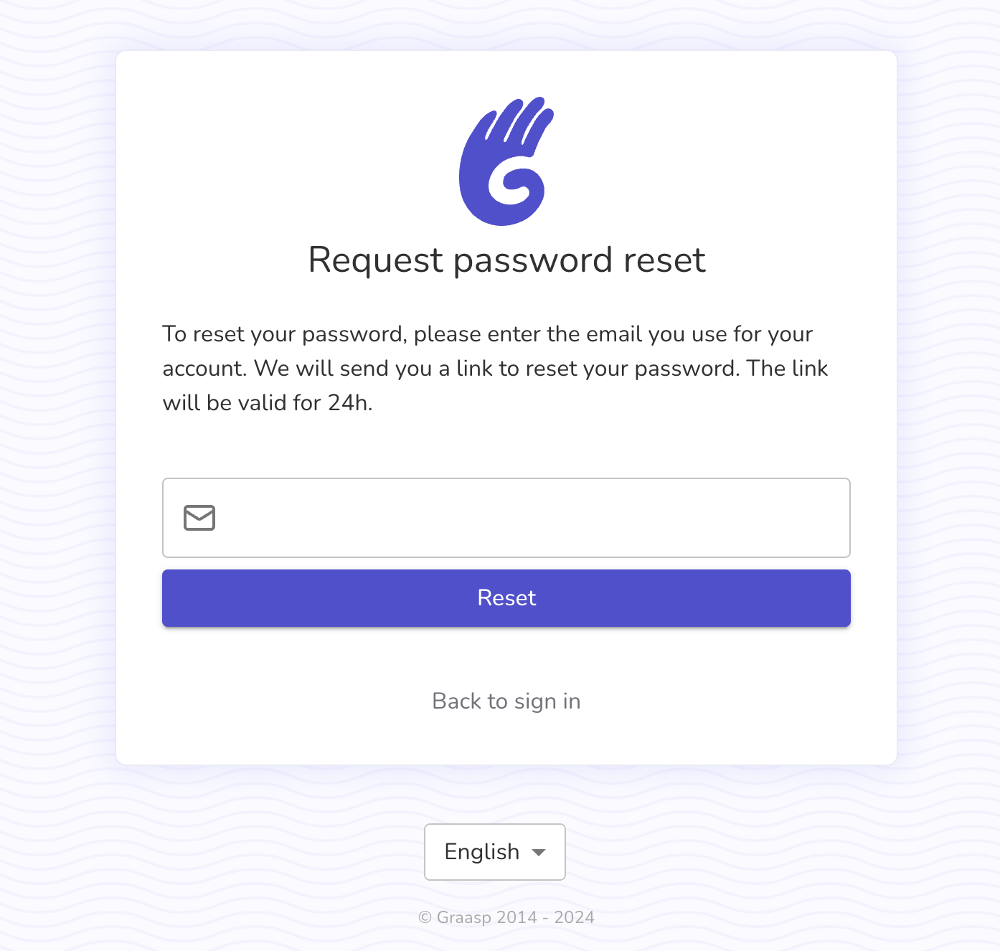
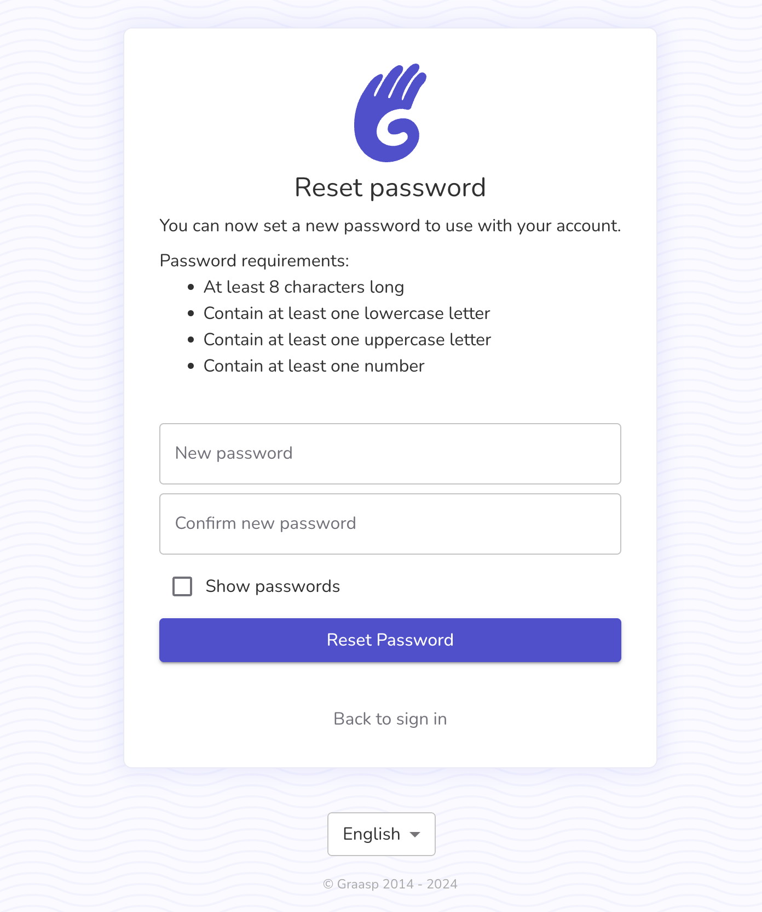

# Forgot Password

On the Graasp platform, you can set a password to sign in into Graasp. If you forget this password, you can request to reset it by the following steps:

1. Click "Forgot Password?" on the login page or go to https://auth.graasp.org/forgot-password.
2. Enter your registered email.

3. Follow the link sent to your email to reset your password. You should see the following screen:

This feature is designed to simplify account recovery. For any issues, contact support.
