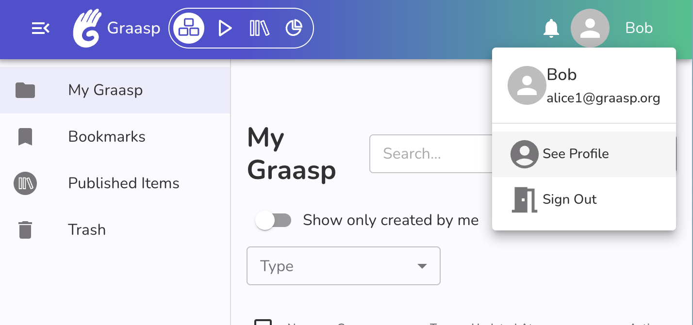

# Account Validation

When you use the Graasp platform, a verified email address is required.

The email address verification is required to create content, publish content in the library and more. Once you have verified your email address you will be able to use all features of the platform.

## When you see the "Your account needs to be validated" message

If you see the message "Your account needs to be validated" (see the image bellow) it means we still need to validate that you have access to the **email address** you provided when you created your Graasp account.

## How to validate my account ? {#validate-account}

To validate your account you need to:

1. Check which email you use with your Graasp account.
2. Ensure you have access to this email.
   1. If you do not have access to this email anymore, change your email.
3. Use that email to login via email.
4. Your account will be validated when you use the link we send you by email.

Below we go in detail on how to perform these steps.

### Check which email you use with Graasp

First verify which email address is in use with your Graasp account.

Click on the avatar and name in the top right of the page.

You should see your name and the email address currently in use with your account just below.

Make sure you have access to this account.

:::tip
If you wish to change the email you use with your Graasp account, checkout out [How to change the email used with my account](../account/email#change-email).
:::
