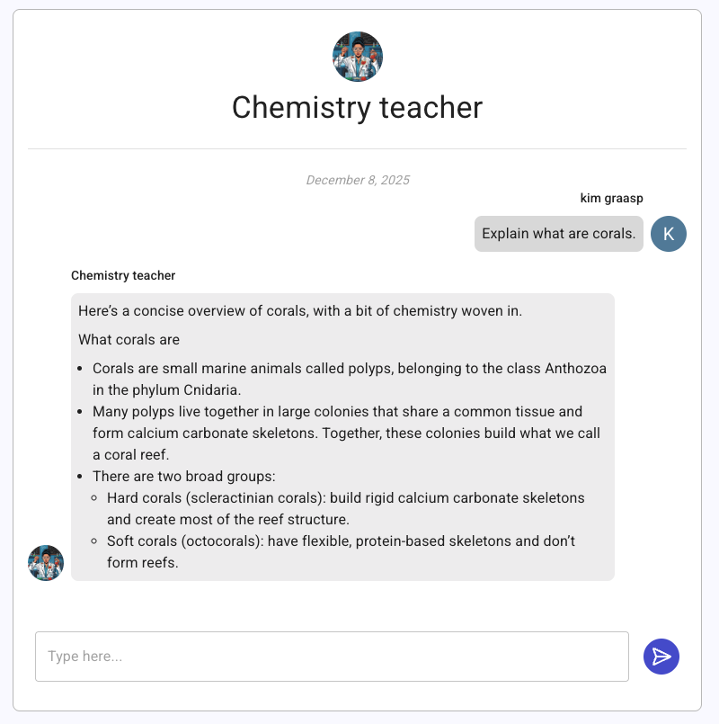

# Chatbot

Graasp includes a configurable chatbot that adds interactivity to your learning activities. The chatbot can take on different roles—for example, a chemistry teacher, a physics tutor, a Socratic peer, or anything else you need.

## Configure Your Chatbot

You can customize the chatbot using the following options:

- **Name** – How the chatbot will be identified during conversations
- **Avatar** – The profile image displayed next to the chatbot’s messages
- **Prompt** – Instructions that define the chatbot’s personality and behavior
- **Conversation starter** – The first message the bot sends to welcome users
- **Conversation suggestions** – Predefined messages users can click to begin the conversation

As an admin, you can also access all conversations users have had with the bot. This is especially helpful for identifying common misunderstandings, frequently asked questions, or topics that may require additional support.

:::warning[Data & Privacy Notice]

Graasp’s chatbot app uses OpenAI’s ChatGPT model to generate responses. User messages are sent to OpenAI via their API for processing. **No additional user data is transmitted.**

However, if users choose to share personal information within their messages, that information will also be sent to OpenAI. Graasp cannot prevent or filter such disclosures, so please encourage users not to share sensitive data.

:::

## Need More?

Have a feature request? Contact us at **support@graasp.org**.

This application is open source. View the source code on [GitHub](https://github.com/graasp/graasp-app-chatbot).
