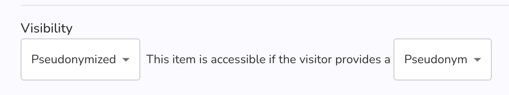
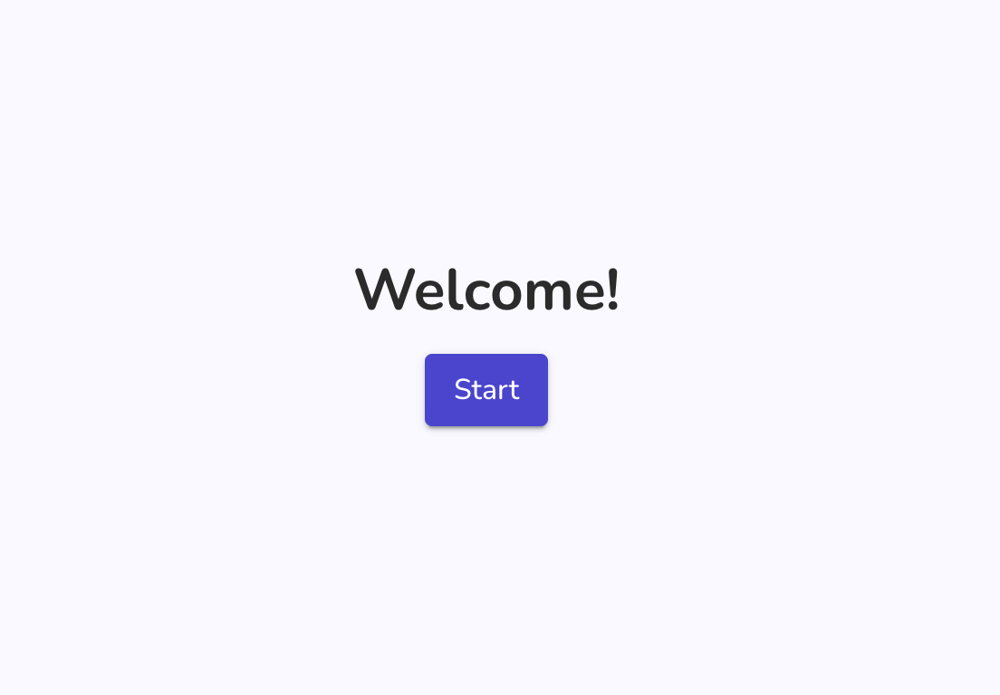

# Auto Login

:::warning

This feature requires a good understanding of Graasp and might be for users that are more technically inclined.

:::

In this article we will use the term `itemLogin` to designate the possibility to log a user only with a pseudonym.

## Purpose {#purpose}

This feature allows to force which itemLogin account will be used for a lesson by providing a url that contains all necessary information for the user.

##  Use cases {#use-cases}

Potential use-cases for this feature include:

- Studies (like Prolific) where you can provide a personalized link to each participant and you want each participant to use a very specific username (i.e. to ease data analysis, or to not collect personal information)

## Setting up your activity {#setup}

In this section we will go over the process for setting up auto login.

1. Create an item
2. Go to this item's sharing page
3. In the sharing page enable "Pseudonymized" access with "Pseudonym". The auto login feature only works with "Pseudonym", it does not work with "Pseudo and password". You should have the same as the following image:

   

4. Create the link to share with users
    1. Go to the item page in the player, it should look like this:

        ```txt
        https://player.graasp.org/:rootId/:itemId
        ```

         where `:rootId` and `:itemId` are unique identifiers.
    2. Append to this URL the `/autoLogin` path:

        ```txt
        https://player.graasp.org/:rootId/:itemId/autoLogin
        ```

    3. Add the username to use as a search query parameter:

        ```txt
        https://player.graasp.org/:rootId/:itemId/autoLogin?username=Bob
        ```

    4. Optionally add other parameters like `fullscreen=true` or `shuffle=true`.

## Usage

If someone uses the url generated in the previous section (`https://player.graasp.org/:rootId/:itemId/autoLogin?username=Bob`), they will see the following page:



Clicking on the "Start" button will log them in as `Bob` and bring them to the activity.

Et *voilà*
