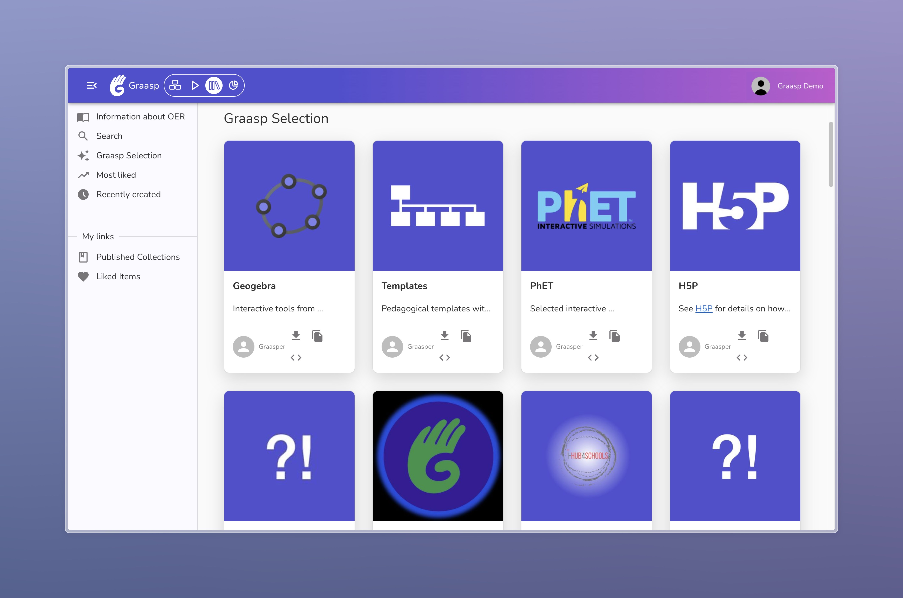
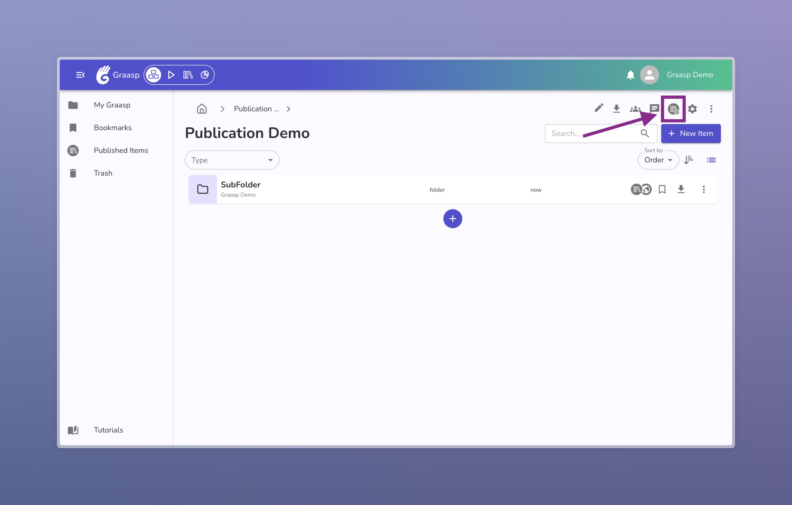
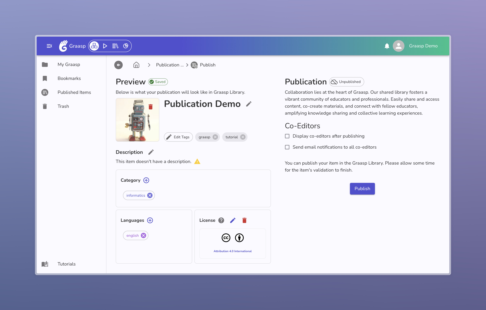
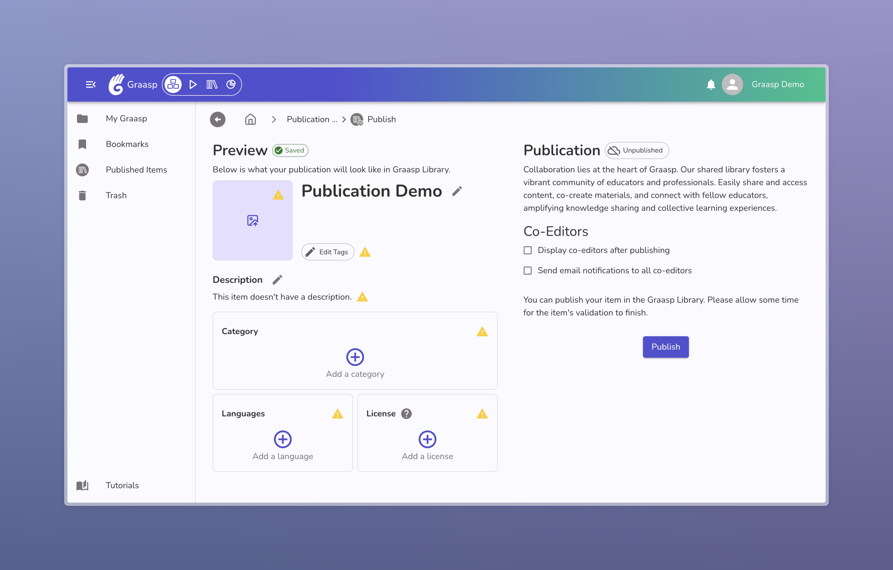
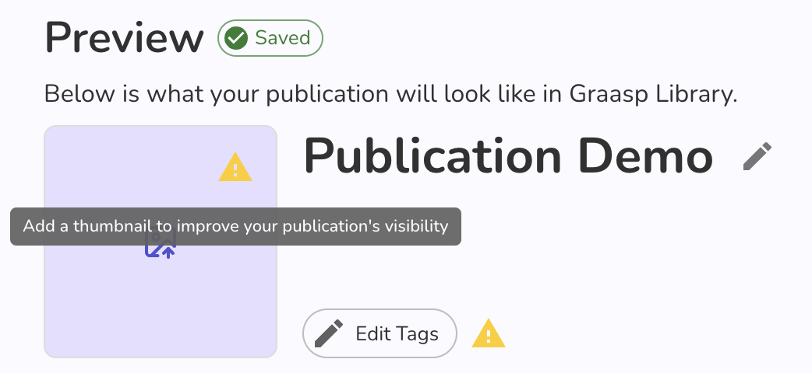
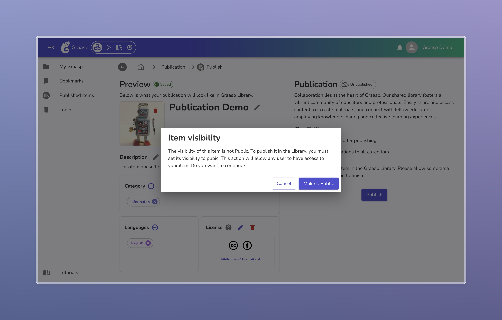
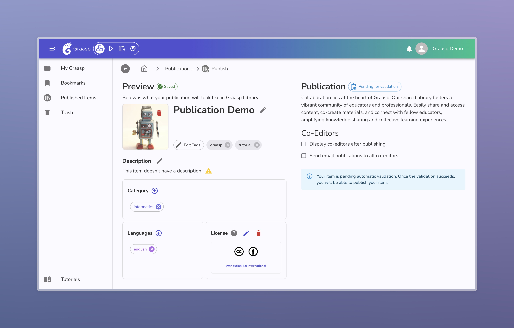
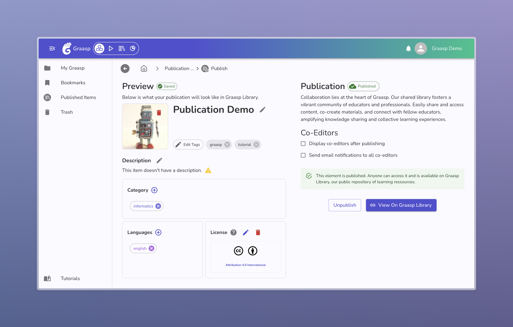
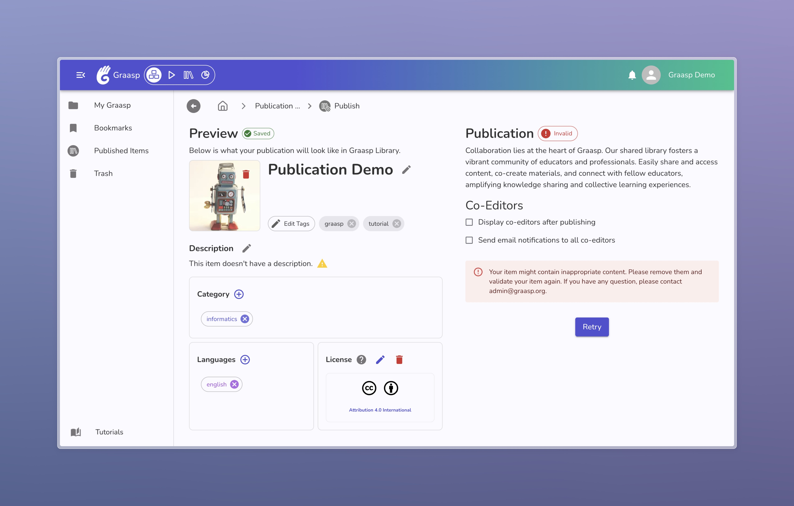
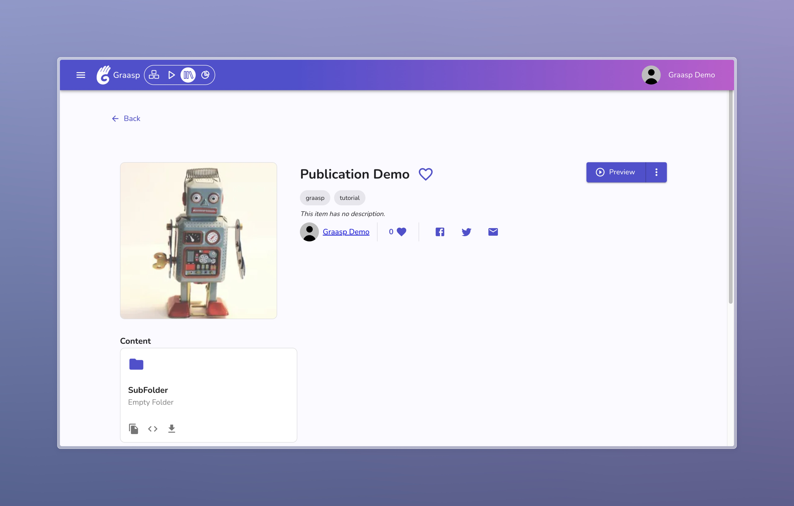

# Publish to Graasp Library

Collaboration is the cornerstone of Graasp Library, where educators and professionals come together to share, co-create and learn. By fostering a vibrant community around a shared library of resources, Graasp enables educators to access, adapt and develop collective knowledge. This shared platform allows to focus on innovation rather than reinventing the wheel, ultimately improving students' learning experiences.

## How Can I Publish My Content?

To publish a content in Graasp Library, open in the Graasp Builder the content folder you wish to publish and click on the publication page button.

Now that the publication page is open, follow the rest of the documentation.

:::warning
Only folders can be published in Graasp Library. It's also important to note that all the content inside a folder will be published too.
:::

### Publication Page

The publication page allows you to edit your current item (if the item has subcontent, you need to open the publication page for each item) and visualize how it will be rendered in the library.

On a large screen, such as a computer, the publication page is divided into two parts. You can find the preview of the publication on the left and the publication's status on the right.

The preview section allows you to edit the item's data, such as its title, description, thumbnail, or tags, for example, and these are displayed similarly to how they appear in Graasp Library.

On the right side, the publication status section lets you know if the item is published. This section is also where you can publish your collection.

### Why Are There Warnings?

If you open the publication page of an item for the first time, you might see many warnings next to the item's data (like the description, the thumbnail, etc.).

These warnings highlight missing data. Filling those fields will improve the visibility of your collection in Graasp Library. To get more information, hover the warning with the mouse.

Once you complete all the fields, you should no longer see any warnings. Your content is then ready to be published.

:::note
You can publish your content even if there are still some warnings, but we encourage you to try to complete all the fields (also in all the elements of your content, not just in the root folder) to maximise visibility in Graasp Library, and to increase the chances that other people will use your content.
:::

### Publish Your Content

When you are ready, click the `Publish` button to start publishing your collection. It is important to understand that your folder and all its content will be visible to anyone at the end of this process. If your folder is **private**, the following modal will be displayed, asking you to change its visibility to **public**.

Once you click on the `Publish` button, the collection will first go through an approval process. This may take a few moments depending on the content. You'll see a "Pending" status while your content is being validated.

:::info
If you don't see an update soon, try to refresh the page.
:::

:::note
We want to make sure that our library is a safe and enjoyable place for everyone. That's why we use AI to check all published content, including yours. We try to respect your privacy as much as possible, using local models. This means that we do not share your private data with any third party. If this should change, we will inform you.
:::

Once your content is approved, it will be published in Graasp Library. You'll see a confirmation message when this happens.

:::info
If the status is stuck on "Pending" for a while, just refresh the page.
:::

We want to ensure Graasp Library is a safe and appropriate space for everyone. If your content contains violence or sexually explicit material, it won't be published. You're welcome to revise and resubmit content that aligns with our guidelines. Don't hesitate to contact us at admin@graasp.org if you believe your content is legitimate.

### Unpublish Your Content

If for any reason, you would like to remove your content from Graasp Library, click on the `Unpublish` button to achieve this action. Your content will then no longer be available in Graasp Library.

:::warning
You will still need to change the visibility to `private` in the item's settings if you want to restrict access. Unpublishing your content will only remove it from the library; its visibility will remain public.
:::

### Viewing Your Content in the Library

The easiest way to view your published content is by clicking the `View on Graasp Library` button. This will redirect you directly to your content in Graasp Library.

Find out more about Graasp by reading the other tutorials available in this user documentation.
