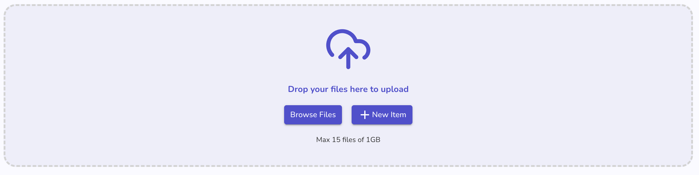
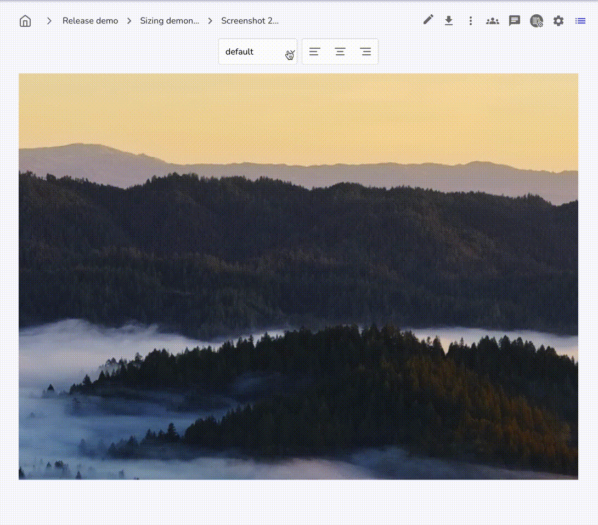
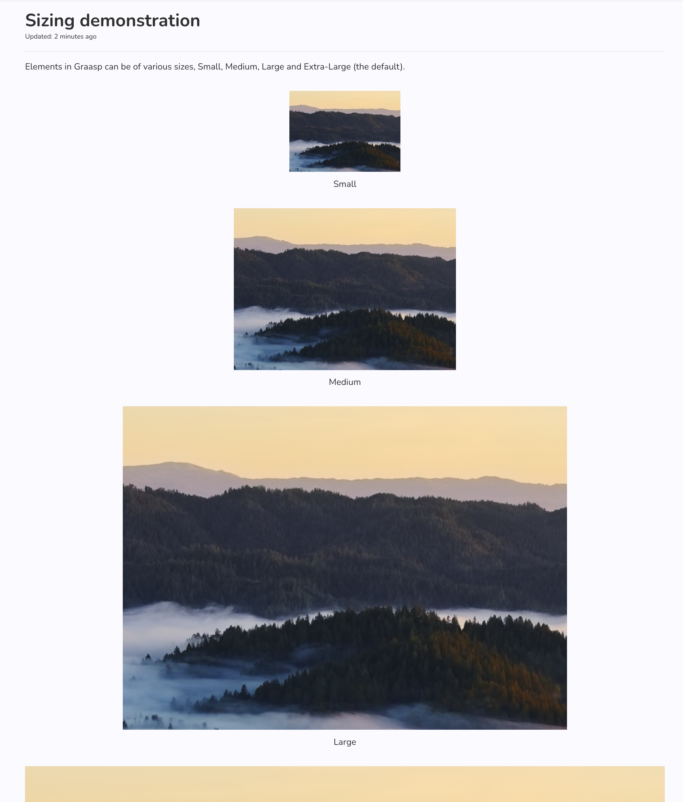
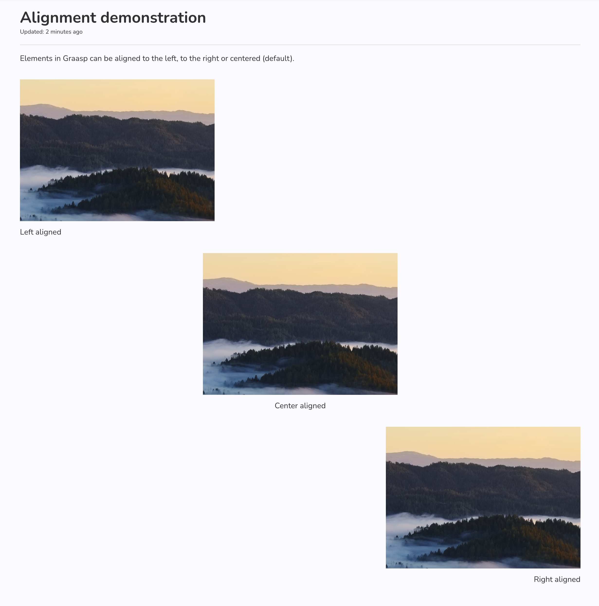

L'été approche et l'équipe Graasp a travaillé sur des mises à jour intéressantes pour vous. Dans cette version, nous avons apporté quelques modifications qui vous permettront d'adapter votre contenu exactement comme vous le souhaitez. Lisez la suite pour plus de détails !

<!-- Everything below this will not be shown in the post overview -->

<!-- truncate -->

## Compte

- Nous avons amélioré l'expérience d'édition de votre profil public. Accédez à [votre page de profil dans le compte Graasp](https://account.graasp.org/profile) et cliquez sur le bouton « Modifier » pour commencer à remplir votre profile public. Il sera affiché dans la bibliothèque lorsque vous publierez certaines ressources pour que les autres puissent les voir.

## Analytique

- **Page de statistiques des membres :** nous avons développé un tableau de bord pour afficher les statistiques des membres dans l'ensemble de l'écosystème Graasp. Cet outil permettra aux utilisateurs de suivre leur activité et leur engagement au fil du temps avec des représentations visuelles telles que des graphiques et des diagrammes. En fournissant des informations sur les modes d'utilisation, le tableau de bord aide les utilisateurs à comprendre leur implication et leur productivité au sein de la plateforme. Des graphiques et des fonctionnalités interactives supplémentaires seront bientôt ajoutés pour améliorer l'expérience utilisateur et fournir des informations encore plus approfondies.

## Constructeur

- Nous avons amélioré la zone de dépôt des fichiers et ses notifications, et remplacé les boutons "Importer ZIP/H5P". Le téléchargement de fichiers devrait être plus rapide et l'interface a été simplifiée pour une expérience plus agréable.

Nous avons ajouté quelques paramètres pour vous aider à dimensionner votre média avec 5 tailles prédéfinies : très petit, petit, moyen, grand et très grand. Par défaut, tous les médias sont affichés en très grand format pour les voir au mieux. Mais si vous préférez qu'il soit très petit, ou seulement moyen, vous pouvez maintenant le régler !

Ci-dessous vous pouvez voir quelques exemples dans le lecteur, avec des images de différentes tailles et alignées en utilisant toutes les valeurs possibles.

 

Nous avons également ajouté la possibilité de choisir l'alignement du média, vous pouvez donc choisir entre gauche, droite et centré. La légende de l'élément sera également alignée sur le côté que vous aurez choisi pour l'afficher de la manière la plus cohérente possible.

## Lecteur

- En lien avec les améliorations apportées aux paramètres de dimensionnement des médias désormais disponibles dans le constructeur, le lecteur affichera désormais les médias comme prévu. Les commentaires sur ces améliorations sont toujours les bienvenus. Envoyez-nous un e-mail !
- Nous avons résolu un problème où la navigation entre différentes capsules d'apprentissage dans le lecteur faisait planter la navigation sur la gauche. Désormais, lorsque cela se produira, vous pourrez recharger la page pour récupérer la navigation. Nous avons prévu de meilleures améliorations, mais cela devrait résoudre le problème pour le moment. Faites-nous savoir par e-mail si vous rencontrez des problèmes connexes.

## Back-end

- Ajout des points de terminaison pour mettre à jour l'email (à venir)
- Autoriser les e-mails avec une extension longue (par exemple `.swiss` )
- Supprimez la possibilité de lier un compte existant à un élément pseudonymisé.

<!-- Generic message -->

Nous accueillons chaleureusement et encourageons les commentaires de nos utilisateurs afin d’améliorer continuellement notre plateforme. Vous pouvez nous contacter par e-mail [admin@graasp.org](mailto:admin@graasp.org) ou en soumettant une issue dans ce [repo Github](https://github.com/graasp/graasp-feedback) .
