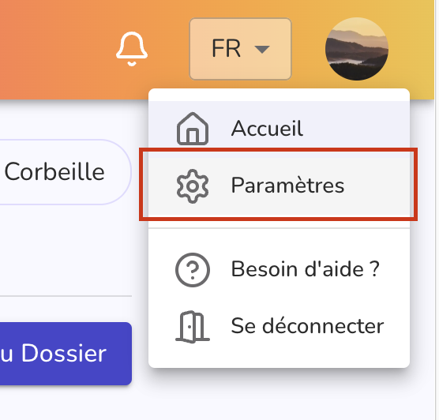
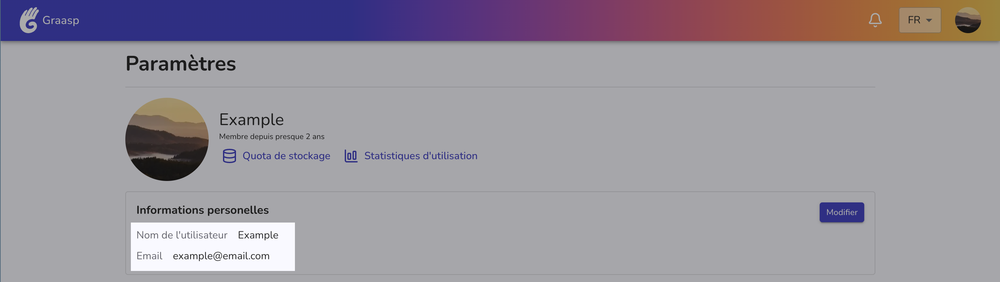

# Adresse e-mail

Sur la plateforme Graasp, votre email sert à vous connecter (via lien magique) et à recevoir des notifications (vous pouvez désactiver les notifications dans votre profil).

## Quelle adresse email est utilisée avec mon compte Graasp ? {#email-used}

Vous pouvez trouver quelle adresse e-mail est utilisée avec votre compte Graasp actuel en cliquant sur l'avatar rond dans le coin supérieur droit de la page. Dans la fenêtre contextuelle qui s'afficher, choisissez **"Paramètres"** (voir image ci-dessous).

:::warning Vous ne voyez pas la même chose ?
Si vous ne voyez pas l'option "Paramètres" dans la fenêtre contextuelle, cela signifie que vous êtes connecté avec un compte pseudonymisé (invité).
Ces comptes ont des capacités limitées et ne peuvent accéder qu'au contenu de l'élément sur lequel ils ont été créés.

Déconnectez-vous de ce compte avec l'option "Déconnection" et connectez-vous à votre compte Graasp via email.
Si vous n'avez pas encore de compte Graasp, vous pouvez en créer un simplement, il vous suffit d'une adresse email. Voir [créer un compte Graasp](../create-account) pour plus d'informations.
:::

La page de paramètres permet de modifier les données liées à votre compte et vos préférences.
La première section encadrée de la page ("Informations personnelles") vous indique le nom d'utilisateur courant ainsi que l'email du compte.

Vous pouvez modifier ces informations. Veuillez vous référer à [Comment changer mon email](#change-email)

## Comment changer mon email ? {#change-email}

Vous pouvez modifier l'e-mail utilisé avec votre compte Graasp sur [la page des paramètres de votre compte](https://graasp.org/account/settings) .

1. Connectez-vous à Graasp en utilisant soit votre email, soit votre email et un mot de passe si vous en avez défini un.

    1. Si vous n'avez pas de mot de passe défini et que vous n'avez pas accès à l'e-mail que vous avez utilisé dans Graasp, veuillez nous contacter (coordonnées de contact disponibles en bas de page).

2. Cliquez sur l'avatar dans le coin supérieur droit de l'écran et sélectionnez « Paramètres » dans la fenêtre contextuelle.

    

3. Cliquez sur le bouton "Modifier" dans la section « Informations personnelles »

4. Remplissez le nouvel e-mail que vous souhaitez utiliser.

5. Enregistrez les modifications.

6. Un e-mail sera envoyé à votre nouvelle adresse e-mail.

    1. Si vous ne recevez pas d'e-mail, cela peut signifier que vous avez essayé d'utiliser un e-mail déjà enregistré auprès de Graasp.

7. Cliquez sur le lien envoyé dans l'e-mail.

8. Cliquez sur le bouton "Valider" sur la page.

    1. Si vous obtenez une erreur, assurez-vous que vous utilisez un nouveau lien. Les liens durent 24 heures. Si votre lien est plus ancien, veuillez mettre à jour à nouveau votre email dans votre profil et utiliser le nouveau lien que vous recevrez.
    2. Assurez-vous de ne pas avoir créé de compte Graasp avec votre nouvelle adresse e-mail.

9. Une fois la validation réussie, vous pouvez vous connecter avec votre nouvel email. Votre ancien email recevra un dernier message vous informant que vous avez déplacé votre compte vers votre nouvel email.
